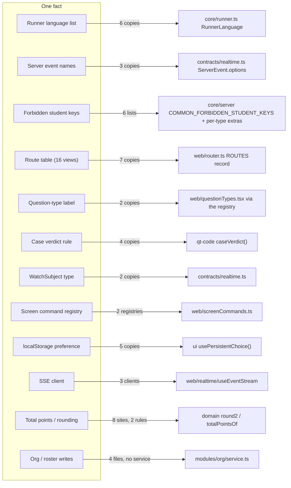
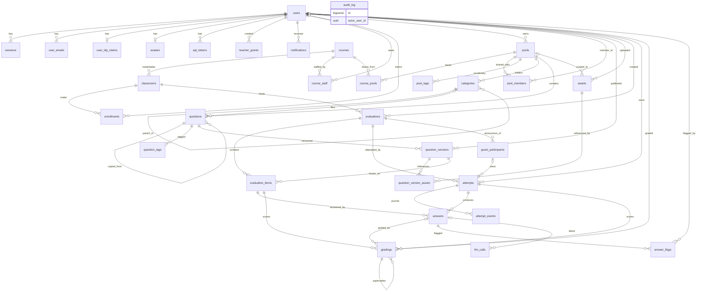
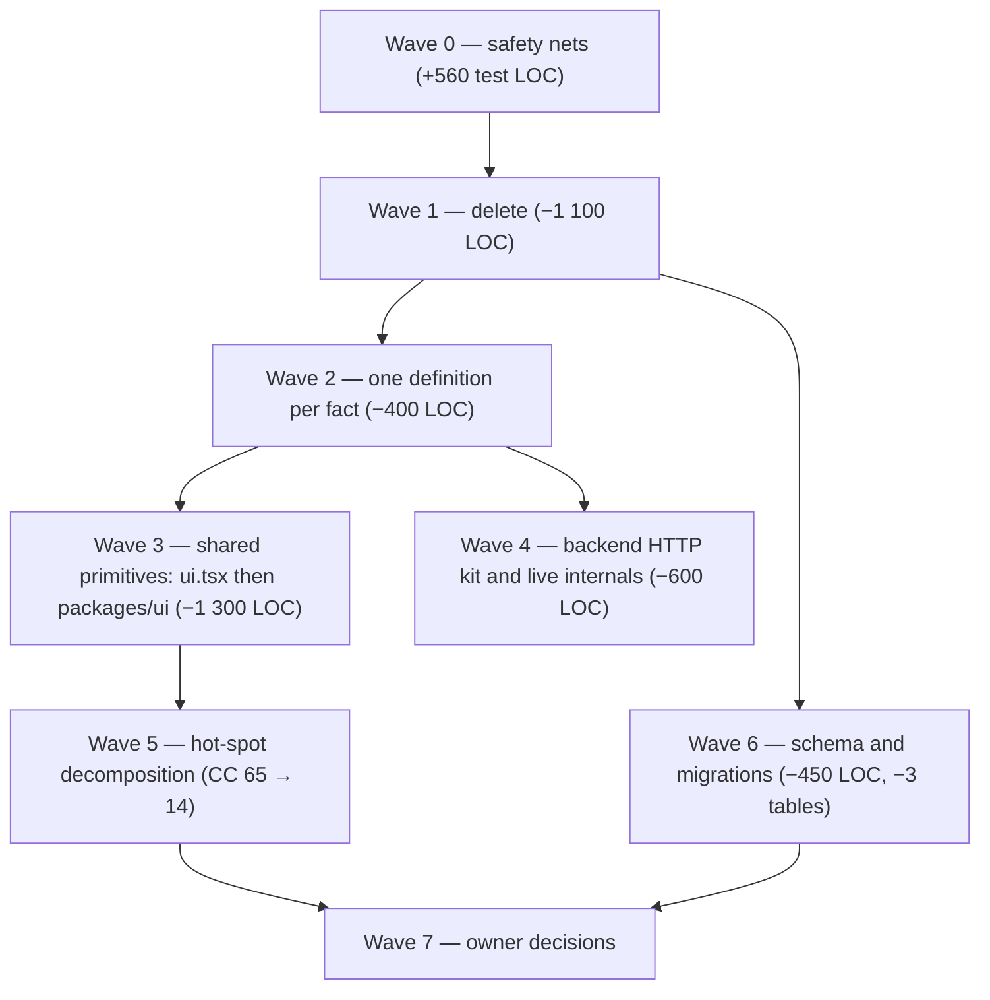

# Codebase audit — complexity, DRY, SSOT, KISS, YAGNI (2026-09-22)

Read-only pass over the whole repository at `74bda42` (`main` moved three
commits during the audit, to `b64983f`; line numbers quoted below may drift
by a few lines in `live/routes.ts`, `realtime/routes.ts` and `evaluation/`).
Nothing was modified. Six independent reviewers (one per area, Opus) each
read the code from the same measured baseline; this document is the
synthesis and the refactoring plan. The six detailed reports and the raw
metrics are in [`audit-2026-09-22/`](audit-2026-09-22/backend.md).

| Detailed report | Findings | Est. net LOC |
| --- | --- | --- |
| [Backend `apps/api`](audit-2026-09-22/backend.md) | B-01 … B-20 | −729 |
| [Frontend core `apps/web` (ui, router, commands, i18n, markdown, mock)](audit-2026-09-22/frontend-core.md) | FC-01 … FC-22 | −1 015 |
| [Frontend feature screens `apps/web/src/*`](audit-2026-09-22/frontend-features.md) | FF-01 … FF-26 | −975 (+400 tests first) |
| [Runner `apps/runner` and its callers](audit-2026-09-22/runner.md) | R-01 … R-16 | −196 (+75 test LOC on invariants) |
| [Shared packages and `qt-*`](audit-2026-09-22/packages.md) | P-01 … P-21 | −887 (incl. +350 for `packages/ui`) |
| [Database](audit-2026-09-22/database.md) | D-01 … D-22 | −450, −3 tables, −31 columns, 8 → 1 migration |
| [Cyclomatic complexity per function](audit-2026-09-22/metrics-complexity.md), [exact clones](audit-2026-09-22/metrics-clones.md), [unused exports and deps](audit-2026-09-22/metrics-knip.md) | | |

## 1. Executive summary

The repository is **124 k lines of TypeScript** (83 k non-test source,
41 k tests) two days after its first commit. It is in better shape than its
size suggests: correctness invariants hold everywhere they were checked,
dead code is rare in the backend, file headers explain their own reasons,
and the schema has no drift. The debt is of a different kind — **the same
knowledge written several times** — and it already produced eleven
user-visible defects (section 6).

Headline numbers:

| Measure | Value |
| --- | --- |
| Non-test source LOC | 83 373 (backend 19 525 · frontend 40 071 · runner 1 443 · packages 5 262 · `qt-*` 17 072) |
| Test LOC | 43 063 |
| Functions | 5 109 non-test; **141 over CC 10, 27 over CC 20**, max **65** |
| Exact clones (jscpd, ≥ 8 lines) | 63 clones, 1.1 % of lines — low; the duplication is *structural*, not textual |
| Exported names never imported (knip + manual) | ≈ 230 in `apps`, ≈ 670 of 997 in `packages` |
| i18n keys | 1 736 per locale, no `en`/`fr` drift, ≈ 50 never read |
| Database | 32 tables, 254 columns, 45 indexes, 51 FKs, 11 jsonb columns, 8 migrations, **0 drift** |
| Three files that block the planned `packages/ui` | `mock/index.ts` 5 839 · `i18n.tsx` 3 922 · `ui.tsx` 2 974 lines |
| Largest service | `live/service.ts` 2 104 lines, five responsibilities |

What the plan in section 7 delivers, all behaviour preserved:

| Outcome | Before | After |
| --- | --- | --- |
| Source LOC (net, double counts removed) | 83 400 | **≈ 79 400 (−4 000, −4.8 %)** |
| Test LOC | 43 000 | ≈ 43 400 (+400 safety net, −100 duplicates, +75 invariant coverage) |
| Max cyclomatic complexity | 65 (`extractNets`) | ≈ 14 |
| Functions over CC 20 | 27 | ≈ 6 |
| Files over 2 000 lines | 5 | 0 |
| Browser initial chunk | — | ≈ 3 100 LOC of grading code and both dictionaries out of it |
| Database | 32 tables / 254 columns / 8 migrations / 624 KB of snapshots | 29 / ≈ 220 / 1 / ≈ 80 KB |
| Grading pass, 100 students × 20 items | ≈ 6 000 SQL statements | ≈ 6 |
| Defects closed as a by-product | — | 11 (section 6), 3 security test gaps |

The honest reading: a **5 % reduction in lines**, not a halving. This code
is not padded; a "massive" cut in LOC would mean deleting features the
spec asks for. What *is* massive is the structural change: three
monoliths split into fourteen files, one `packages/ui` absorbing sixteen
duplicated shapes, seven copies of the route table reduced to one, four
copies of the case-verdict rule reduced to one, the migration history
squashed, and the SSE, command and preference plumbing implemented once
each. Those are the changes that make the next 10 k lines cheaper.

## 2. The repository, measured

### 2.1 Size and complexity by area

| Area | Src files | Src LOC | Test files | Test LOC | Functions | CC > 10 | CC > 20 | Max CC |
| --- | ---: | ---: | ---: | ---: | ---: | ---: | ---: | ---: |
| Backend `apps/api` | 71 | 19 525 | 34 | 9 729 | 1 092 | 21 | 1 | 21 |
| Frontend `apps/web` | 154 | 40 071 | 78 | 20 862 | 2 725 | 72 | 14 | 40 |
| Runner `apps/runner` | 13 | 1 443 | 11 | 1 820 | 102 | 2 | 0 | 15 |
| Packages (contracts, core, domain, registry) | 40 | 5 262 | 18 | 1 846 | 174 | 5 | 0 | 17 |
| Question types `qt-*` | 79 | 17 072 | 46 | 8 806 | 1 002 | 39 | 12 | 65 |

Cyclomatic complexity was computed on the TypeScript AST (1 + `if`, loops,
`case`, `catch`, `?:`, `&&`, `||`, `??`; nested functions counted apart).
The full per-function table is in
[`metrics-complexity.md`](audit-2026-09-22/metrics-complexity.md).

### 2.2 The twenty hot spots

| CC | Lines | Function | Where | Verdict |
| ---: | ---: | --- | --- | --- |
| 65 | 264 | `extractNets` | `packages/qt-circuit/src/netlist.ts:234` | seven phases welded together; split + point index → CC ≈ 8 (P-02) |
| 40 | 504 | `GradingPanel` | `apps/web/src/grading/GradingPanel.tsx:65` | four screens in one function; three hooks + one component → ≈ 12 (FF-05) |
| 40 | 942 | `RichText` | `apps/web/src/markdown/RichText.tsx:187` | pure extraction, five commits → ≈ 12 (FC-06) |
| 38 | 1 019 | `SchematicEditor` | `packages/qt-circuit/src/canvas/SchematicEditor.tsx:247` | four hook seams already visible (P-08) |
| 37 | 85 | `astar` | `packages/qt-circuit/src/canvas/router.ts:122` | P-13 |
| 36 | 151 | `App` | `apps/web/src/App.tsx:135` | the route table written seven times → table lookup, CC ≈ 8 (FC-05) |
| 35 | 338 | `CodePlayer` | `packages/qt-code/src/Player.tsx:113` | P-21, R-06 |
| 31 | 115 | `handleKeyDown` | `RichText.tsx:324` | FC-06 |
| 30 | 633 | `CircuitEditor` | `packages/qt-circuit/src/Editor.tsx:256` | same editor as `CodeEditor` (P-15) |
| 29 | 224 | `CircuitReview` | `packages/qt-circuit/src/Review.tsx:107` | P-01 |
| 28 | 355 | `PollProjection` | `apps/web/src/poll/PollProjection.tsx:280` | four hooks at module scope belong elsewhere (FF-09) |
| 28 | 585 | `QuestionEditor` | `apps/web/src/question/QuestionEditor.tsx:79` | FF-16 |
| 27 | 204 | `buildCommands` | `apps/web/src/commands.ts:106` | FC-05 |
| 26 | 330 | `PoolView` | `apps/web/src/pool/PoolView.tsx:205` | FF-17 |
| 26 | 43 | `parsePath` | `apps/web/src/router.ts:91` | FC-05 |
| 25 | 350 | `LiveDashboard` | `apps/web/src/live/LiveDashboard.tsx:65` | FF-06 |
| 25 | 234 | `PollJoin` | `apps/web/src/poll/PollJoin.tsx:76` | FF-24 |
| 23 | 302 | `EvaluationConfig` | `apps/web/src/evaluation/EvaluationConfig.tsx:111` | keep; the flow is documented |
| 23 | 305 | `Player` | `apps/web/src/student/Player.tsx:97` | FF-24, last in the order (exam conditions) |
| 21 | 98 | `gradingQueue` | `apps/api/src/modules/grading/service.ts:350` | B-14, D-12 |

The backend is the calm area: max CC 21, 21 functions over 10. The runner
is calmer still. Complexity lives in the React surfaces and in
`qt-circuit`, which alone holds **51 % of the package complexity** (ΣCC
1 610 of 3 175) in 40 % of the package source.

### 2.3 Duplication

Exact text duplication is low (1.1 %). Of the 63 clones,
[`metrics-clones.md`](audit-2026-09-22/metrics-clones.md) shows the shape
of the problem: a 75-line byte-identical `styles.ts` in `qt-code` and
`qt-circuit`; 43- and 42-line blocks shared by `qt-mcq/ui.tsx` and
`qt-short/ui.tsx`; five nearly identical route preambles across the API
modules; the same `vitest.config.ts` three times. The structural
duplication the reviewers found by reading is an order of magnitude
larger than what jscpd measures, and it is listed per area below.

### 2.4 Dead surface

knip and a manual import-graph pass agree: dead code is concentrated in
the frontend and the packages, not in the backend.

| Where | Never imported | Truly dead (safe to delete) | Examples |
| --- | ---: | ---: | --- |
| `apps/api` | 40 | 3 exports + 1 route + 1 queue + 1 SSE alias | `GET /app/events`, `HOUSEKEEPING_QUEUE`, `GET /classrooms/:id/join-code`, `NothingToRun`, `seatOf` |
| `apps/web` | 161 | 43 exports, 50 i18n keys, `RangeCalendar` (154 LOC), `Breadcrumb.tsx`, `@tiptap/extension-link` | FC-01, FC-02, FC-13, FC-18 |
| `packages/*` | ≈ 670 of 997 exported names | ≈ 220 LOC; the `"."` entry of `@quiz/core`; the `./*` map of `@quiz/domain`; 18 `*Props` types; 3 unused `@quiz/qt-*` deps in `apps/api` | P-18 |
| Database | 3 tables, 28 columns, 5 FKs, 3 indexes | `answer_flags`, `llm_calls`, `api_tokens`; `evaluations.released_grades` written, never read | D-04, D-06 |

## 3. Findings by area

### 3.1 Backend (`apps/api`, 19.5 k LOC, 78 route paths)

**Verdict.** Correct, well guarded, almost no dead code, but ~600 lines of
mechanical repetition in the HTTP layer and two structural gaps.

| Id | Finding | Principle | LOC | Risk |
| --- | --- | --- | ---: | --- |
| B-01 | 21 inline `audit()` blocks in `pool/routes.ts` and 15 in `courses.ts` (292 lines) while five other modules already have a `trace()` closure | DRY | −190 | low |
| B-02 | The same nine-line route preamble (params parse → guard → try/catch → error map) 60 times; `if (!scope) return reply;` ×60 | DRY | −180 | med |
| B-03 | `invalid()` defined six times verbatim, `emptyBody()` six times, and three different 400 body shapes for one validation failure | DRY | −50 | low |
| B-09 / B-10 | Six `/evaluations/:id/items*` handlers share an 11-line body; `POST /answers/:id/gradings` and `POST /gradings/:id/override` are one handler twice | DRY | −55 | low |
| B-11 | Dead surface: `GET /app/events` (the SPA uses `/app/api/events`), `HOUSEKEEPING_QUEUE`, join-code route, a second `unavailableRunner` in `pool/routes.ts`, three unused `@quiz/qt-*` deps | YAGNI | −60 | low |
| B-04 | `attemptView` and `previewView` in `live/service.ts` are the same function twice | DRY | −40 | low |
| B-07 | `reachable()` in `realtime/routes.ts` re-implements `guards.ts#reachableEvaluation` — **invariant 6's predicate exists twice** | ARCH | −25 | low |
| B-05 | `assertWritable` / `assertOpen` / `isOpen` / `submitAttempt` encode the "is this attempt writable" predicate four times (invariant 5 drift surface) | DRY | −25 | med |
| B-08 | "Total points" computed eight ways; `results`/`grading` use `round2`, `live`/`evaluation`/`csv` use `Math.round(x*100)/100` — two rounding rules for one number | SSOT | −10 | low |
| B-12 | The `org` domain has **no service layer**: `courses.ts` runs 18 `app.db.*` statements inside handlers, spread over `courses.ts`, `roster.ts`, `org/`, `student.ts` | ARCH | 0 (move) | decision |
| B-13 | `live/service.ts` is 2 104 lines and five responsibilities (attempt life-cycle, autosave, dashboard, runs, ticker tasks) | ARCH | 0 (move) | decision |
| B-15 | `results/service.ts` imports `CodeDetails` from `@quiz/qt-code` and hard-codes `if (type === "mcq"/"cloze")` — the only generic module that knows a concrete type (spec §5.3) | ARCH | +10 | med |

Keep as is: the 14 near-identical loaders in `guards.ts` (invariant 6 must
stay readable at a glance), the three-layer event path (spec §5.2 rule 4),
`Coalescer`, `InProcessQueue`, the 29 environment variables (all read),
`smoke.sh`.

### 3.2 Frontend core (`apps/web/src` cross-cutting layer, 19.5 k LOC)

**Verdict.** A real design system with a reason per value, a centralised
focus contract, a 72-line API client. The debt is leftovers from the
`heig-classroom` ancestor, three mechanisms implemented twice, and three
files that grew past the point where `packages/ui` can be a move rather
than a rewrite.

| Id | Finding | Principle | LOC | Risk |
| --- | --- | --- | ---: | --- |
| FC-02 | `RangeCalendar` and four helpers (`ui.tsx:2314-2452`, CC 17, untranslated month names) imported by nothing | YAGNI | −154 | none |
| FC-18 | 43 dead exports and `@tiptap/extension-link` unused | YAGNI | −120 | none |
| FC-01 | 50 i18n keys nothing reads (110 dictionary lines) — add the unused-key test in the same commit | YAGNI | −110 | none |
| FC-07 | Seven form dialogs repeat the same 18-line footer + error block | DRY | −85 | low |
| FC-13 | `Breadcrumb.tsx` is dead; six pages hand-roll the eyebrow back-link with two class lists | YAGNI/DRY | −70 | low |
| FC-22 | `mcq`'s `Stats` component is registered, translated, and mounted by no screen (spec §8.6 wants it) | YAGNI/decision | −65 or +3 | low |
| FC-11 | `apiErrorMessage` plumbing at 42 sites in two shapes | DRY | −60 | none |
| FC-14 | Five copies of the listbox keyboard handler, two of the roving-tabindex one | DRY | −60 | low |
| FC-05 | **The route table is written seven times** (`Route` union, `routeToPath`, `parsePath`, `App`'s 14-branch ternary, `STUDENT_ROUTES`, `Shell`'s nav, `buildCommands`) — `App` CC 36 and `parsePath` CC 26 because of it | SSOT/CC | −30 | med |
| FC-06 | `RichText` is a 942-line function at CC 40; five pure extractions gated by 1 680 lines of existing tests | CC | 0 | low |
| FC-03 | Two registries for "the commands of the mounted screen" (`screenCommands.ts` vs `registerContextualCommands`) with contradictory docblocks; spec §8.4 names one | KISS | −35 | low |
| FC-09 | `NAMED_EVENTS` restates the `ServerEvent` union by hand: a new server event is silently never delivered | SSOT | −14 | none |
| FC-15 | `ui.tsx` (2 974 lines) imports `api.ts` and cycles with `help.tsx`; it cannot become `packages/ui` until the cycle is broken and the file is split along its own four banners | ARCH | 0 | med |
| FC-16 | `i18n.tsx` (3 922 lines) ships both dictionaries in the first chunk and is the top merge-conflict surface | ARCH | 0 | low |
| FC-17 | `mock/index.ts` (5 839 lines, 122 handlers) is a second implementation of the API validated against nothing; split by module and add one contract test | ARCH | +40 | low |
| FC-20 | Seven English literals reach the screen from core primitives (invariant 1) | I18N | +7 keys | none |

Keep as is: `api.ts`, `useLayer`, the hand-rolled router (a dependency
would cost more), `fuzzy.ts`, `style.css` (no dead CSS), `DevGallery` and
the mock layer's existence, the `translated()` bridge, the two shortcut
registries (genuinely two things).

### 3.3 Frontend feature screens (`pool/ question/ evaluation/ live/ poll/ grading/ results/ student/ attempt/`, 19.9 k LOC)

**Verdict.** Every screen passes the one-primary-action test; no flow
needs reconsidering. What the features do is re-implement what the core
already offers, and say the same UI idea three to seven times.

| Id | Finding | Principle | LOC | Risk |
| --- | --- | --- | ---: | --- |
| FF-03 | Three hand-rolled ARIA comboboxes (`TagInput`, `TeacherPicker`, `SearchBox`) with byte-identical popover class strings and blur grace, already drifting | DRY | −120 | med |
| FF-04 | `attempt/attemptStream.ts` is a second SSE client and hand-writes `WatchSubject`, shadowing the zod-inferred one (invariant 7); the only real difference (first open vs reconnect, F-EVAL-13) is two callbacks on `useEventStream` | DRY/SSOT | −100 | med |
| FF-10 | Four create/rename modals with one skeleton; `disabled={x.trim()===""}` five times | DRY | −80 | low |
| FF-13 | "Eyebrow + soft panel" copy-pasted seven times with three paddings | DRY | −55 | low |
| FF-12 | = FC-03: `useLiveCommands` uses the second registry with 54 lines of ref machinery | KISS | −50 | low |
| FF-06 | `isTyping` written four times; `useFullscreen` twice — **the dashboard copy lacks the `fullscreenchange` listener**, so Escape leaves the teacher stuck in the overlay | DRY + bug | −45 | low |
| FF-08 | Five `localStorage` preference readers; two (`PoolsPage`, `TeacherHome`) crash in a private window | DRY + bug | −45 | low |
| FF-14 | Seven hand-rolled page skeletons, none alike | DRY | −45 | low |
| FF-15 | Duplicate + delete question implemented twice (`PoolView`, `QuestionEditor`) | DRY | −45 | low |
| FF-01 | `grading/progress.ts` opens a second `EventSource` on a comment that is now stale (`useEventStream` already subscribes `grading.progress`); breaks "one connection per page" | DRY | −40 | low |
| FF-02 | = FC-04: two `typeLabel` with reversed argument order; the evaluation one hard-codes four types so **`circuit` renders raw and untranslated** on five teacher surfaces (N-I18N-01) | SSOT + bug | −25 | low |
| FF-07 | ≈ 70 raw query-key literals; `GET /pools/:id/questions` cached under **two roots**, so the question picker shows stale data after a create | SSOT + bug | −25 | low |
| FF-11 | `AddQuestionsSheet` rebuilds `questionQuery`, hard-codes the type list (no `circuit`), renders difficulty as `"●".repeat(d)` instead of the tested `DifficultyDots` | DRY | −30 | low |
| FF-21 | Score formatting as seven one-liners for two rules (points: two decimals; grade: one decimal, Swiss); belongs in `packages/domain` (invariant 8) | SSOT | −20 | low |
| FF-05 / 09 / 16 / 17 / 24 | The five CC > 20 orchestrators (`GradingPanel`, `PollProjection`, `QuestionEditor`, `PoolView`, `Player`) decomposed into hooks and sub-components, rendered DOM identical | CC | −130 | med |
| FF-22 | `Lobby`'s `navigation` prop is passed only by its own test; the F-LIVE-08 explanations are never shown to a student — a product decision, not a cleanup | YAGNI/decision | ±15 | — |

Keep as is: `playerReducer` + `autosave` (pure state machines, 476 test
lines), `StudentGrid`'s documented seven-column rule break, the small pure
modules (`labels.ts`, `cells.ts`, `pollTally.ts`, `fit.ts`, `presets.ts`),
the verbose file headers — they are why this audit could be precise.

### 3.4 Runner (`apps/runner`, its API client, `qt-code`, `qt-circuit`'s spice path, the browser runner)

**Verdict.** The best-shaped area. 1 359 source lines, max CC 15, the
hardening real and asserted flag for flag. The gaps are in the *tests of
the invariants* and in four copies of one rule.

| Id | Finding | Principle | LOC | Risk |
| --- | --- | --- | ---: | --- |
| R-01 | **Invariant 13 (`--remote --url`) has no real test**: `engine.test.ts:84-88` asserts a fake capability; deleting the three lines that build the flags keeps the suite green | SEC | +25 test | none |
| R-02 | `packages/qt-circuit/src/spice.int.test.ts` runs `podman --remote run` with **no hardening flags and no `--url`** — the only `podman run` outside `containerArgs`, undocumented (invariant 12) | SEC | −20 | low |
| R-03 | Nothing proves the seccomp profile is in force; only the flag and a *local* `existsSync` are checked, while the podman server is what opens the path | SEC | +21 test | none |
| R-06 | **Four divergent copies of "did this case pass?"** (`qt-code/grade.ts` is the authority; `live/service.ts:1424` omits `run.oom` and the teacher's compare options; `Editor.tsx`, `Player.tsx` differ again). A question with `ignoreCase: true` shows "Output differs" in the player and full marks in the grade — contra ADR-015 §2 | DRY + bug | −45 | med |
| R-12 | Two tests re-prove the queue's priority and 429 rule through HTTP; `queue.test.ts` already proves it | YAGNI | −70 test | none |
| R-08 | Integration-suite bootstrap copy-pasted three times | DRY | −75 test | none |
| R-07 | `runVisibleCases` and `simulateAnswer` in `live/service.ts` share ≈ 55 lines (gate, item, rate limit, parse, build, journal, run) | DRY | −45 | low |
| R-09 / R-10 | `--remote --url` built in six places; the language list in six, the main-file table in four (`images.ts` hand-writes what `RunnerLanguage.options` gives) | SSOT | −33 | low |
| R-04 / R-05 | `memoryMb`/`timeMs` have no service-side ceiling (only the wire schema); containers run without `--rm` and are never reaped after a crash | SEC/ops | +36 | none |
| R-11 | Dead: `listAvailableLanguages`, `buildInteractiveRequest` (test-only), inline `unavailableRunner`, `BackendRun`'s never-read `request` parameter (a trap for invariant 14) | YAGNI | −32 | none |

Keep as is, and do not touch: `containerArgs`, `CONTAINER_ENV`, no mounts,
`sanitizeFileName`, sources via `cp /dev/stdin`, argv-only commands, the
two clocks, the seccomp profile, `RunQueue`, `UnavailableRunner`,
`HttpRunner`'s error mapping, `apps/runner` as an app (ADR-016), the
browser/server split (ADR-015).

### 3.5 Shared packages (`contracts`, `core`, `domain`, `registry`, five `qt-*`)

**Verdict.** Invariants 4, 8 and 14 respected. The five question-type
surfaces are ≈ 21 % duplicate (verified with `diff`, not by eye), the
public surfaces are three times what is consumed, and `qt-circuit`'s
complexity is not algorithmic — it is one function per phase that was
never split.

| Id | Finding | Principle | LOC | Risk |
| --- | --- | --- | ---: | --- |
| P-01 | **`packages/ui`** absorbs sixteen duplicated shapes across the five `qt-*` surfaces: the 75-line token table, `PromptField` (same six-line comment in all five), `RowList`, `Segmented`, `IssueList` (×4), `Verdict`, `ScoreHeader`, `TryPanel`, `NumberField`, `CheckboxField`, … Closes four live divergences (`rounded-xl` vs the token, `—` vs `0` for ungraded, `disabled` ignored by two of five players, `qt-code` rendering no `ConfigIssue`) | DRY | −980 +350 | med (visual) |
| P-02 | `extractNets` CC 65: split the seven banner-delimited phases into functions, replace two O(n²) exact-point loops with a `Map` index → CC ≈ 8 | CC | +10 | low |
| P-07 | `qt-circuit/client.tsx` statically re-exports the grader, the netlist extractor and the SPICE emitter — **≈ 1 940 LOC of grading code in every page's initial chunk** for the dev mock alone | ARCH | −8, −1 940 bundle | low |
| P-03 | All twelve `qt-*` imports take the `@quiz/domain` barrel while the comment above names the subpath; the `./*` export map is never used | ARCH | −1 200 bundle | low |
| P-18 | Dead and internal-only exports; the `"."` key of `@quiz/core`; unused peerDeps in `registry`; three unused `qt-*` deps in `apps/api` | YAGNI | −220 | none |
| P-06 | **Five hand-maintained forbidden-key lists** (12–22 entries) that disagree with each other *and* with the API's `studentView.ts`; five API-forbidden keys no package test checks | SSOT (invariant 4) | −55 | low |
| P-09 | `isStaffOnly`, the SSE staff filter, is a hand-written array with no compile-time link to the 12-member `ServerEvent` union, in the one package whose `test` script is `echo 'no tests yet'` | SSOT/security | +60 test | none |
| P-10 | Four definitions of the language list (one with a false "same list" comment, one name collision), two of the MCQ policy list | SSOT | −10 | low |
| P-15 | `CircuitEditor` (633 lines) and `CodeEditor` (662) are the same editor twice; jscpd finds four clone pairs | DRY | −180 | med |
| P-05 | `questionTypes.tsx` hand-rebuilds ≈ 90 lines of parameterised strings for two types because their dictionaries hold functions; templates + a 3-line `fmt()` cover all five | DRY | −90 | low |
| P-11 | = B-15: `apps/api` depends on four `qt-*` packages and hard-codes per-type knowledge in `results` | ARCH | +10 | med |
| P-19 | Five HTTP *response* schemas in `contracts` declared and never validated against — invariant 7 holds for inputs only | SSOT | 0 | none |
| P-08 / P-12 / P-13 / P-14 | `SchematicEditor` (1 019 lines), `emitDevices` (16-arm switch where a per-kind table exists), `astar`, and three symbols defined twice in `qt-circuit` with *different semantics* | CC/SSOT | ±0 | low |

On trimming `qt-circuit`: `schema.ts` was checked field by field against
spec §4.11 and implements exactly that list; §4.11 itself mandates the
canvas. The 9.1 k lines are not gold plating. The one honest question is
**zoom and pan on a fixed-size box** (≈ 180 LOC) — the read-only
`SchematicView` uses `FIT_VIEW` alone. That is a question for the owner.

## 4. Cross-cutting: knowledge written more than once

The single most useful picture of this audit. Each row is one fact that
several files restate by hand, with the number of copies and the one place
the plan leaves it.

Beyond these, the five `qt-*` React surfaces restate the same sixteen
components (section 3.5) and the six API route files restate the same
preamble sixty times (section 3.1). Those two are where most of the lines
go.

## 5. Database

### 5.1 In numbers

| Measure | Value |
| --- | --- |
| Tables / columns | 32 / 254 (mean 7.9, max 23 on `evaluations`) |
| Enums | 0 PostgreSQL enums; every enum is `text` + a TypeScript union (a good trade) |
| jsonb columns | 11 (question config, answer payload, grading details, three settings blobs on `evaluations`, notification payload, journal details, IdP claims, audit payload, `released_grades`) |
| Indexes | 45 — 12 unique, **8 partial** (each encodes a concurrency invariant), 3 on expressions, 1 GIN |
| Foreign keys | 51 — 35 `CASCADE`, 4 `SET NULL`, 12 `NO ACTION` |
| Checks | 2 |
| Migrations | 8, 478 SQL lines, 624 KB of meta snapshots, all generated within 32 hours |
| Schema ↔ migrations drift | **none** (`drizzle-kit check` passes; `generate` on a copy produces nothing) |
| DB tests | 21 `*.db.test.ts`, 7 273 lines, run against the real migrations on PGlite |

### 5.2 Structure

`answer_flags`, `llm_calls` and `api_tokens` are drawn but referenced by
no line of code outside `db/`. `audit_log` is detached on purpose (no FK
on `actor_user_id`, so pseudonymising an account cannot cascade into it).

### 5.3 Verdict on the architecture

The modelling is sound and in places excellent: the eight partial indexes
encode business invariants the service could not enforce under
concurrency (one draft per question, one validated grading per cell, the
ticker's free deadline sweep); `question_versions.search` is a stored
generated tsvector so TypeScript and PostgreSQL cannot drift;
`evaluation_items.question_version_id` is `NO ACTION`, so F-EVAL-03
immutability is enforced by the engine; `attempts.state` is stored
because it is the predicate of the one-second ticker's index. The
PGlite/PostgreSQL bridge costs ≈ 135 lines and buys a container-free
`pnpm dev` and tests on the real migrations. Keep all of that.

What is wrong is concentrated:

| Id | Finding | Category | LOC / effect | Risk |
| --- | --- | --- | --- | --- |
| D-01 | `writeGrading` opens **one transaction with three statements per graded cell**; 100 × 20 = 2 000 transactions, 6 000 statements on a single-CPU VM. `.returning()` then a batched writer | QUERIES | +27, −6 000 statements | low |
| D-03 | `evaluations.access_code` — the column every poll QR scan queries — has **no index and no uniqueness**; the code draw is check-then-insert, so two teachers can receive the same code. Partial unique index on `(access_code) WHERE mode='poll' AND state='running'` | SCHEMA | −8, one race closed | low |
| D-02 | Five sites in four modules write `evaluations` / `evaluation_items` / `guest_participants` — one of them from a `routes.ts` (convention: a table belongs to one module) | OWNERSHIP | +33 | low |
| D-04 | `answer_flags`, `llm_calls`, `api_tokens`: 28 columns nothing reads or writes; `llm_calls` does not match its own spec row | YAGNI | −118 | very low |
| D-05 | The student home five-table join is written twice (`live`, `results`), each with an N+1 its own comment denies (21 queries for ten released evaluations) | QUERIES | −37, 21 → 3 queries | low |
| D-07 | The notification → pool relation lives inside jsonb and is joined by `pools.id::text = payload->>'poolId'`, unindexable, twice per bell refresh | NORMALIZATION | −32 | low |
| D-08 | `0007_poll_guests.sql` adds `token_hash text NOT NULL` with no default — it fails on a non-empty table, one migration after `0006` states that a migration must never depend on an empty table. Squash to one `0000_init` **only if production holds no data worth keeping**; otherwise fix `0007` and adopt `generate --name` | MIGRATIONS | −345 SQL, −540 KB | medium |
| D-06 | `evaluations.released_grades` is written and never read: neither the cache the glossary promises nor an audit record (unrelease deletes it). Decide (a) read it as the cache, or (b) drop it | NORMALIZATION | −21 or +14 | decision |
| D-09 | `enrollments.status` is fully redundant with `user_id IS NULL` (eight writes set both, fourteen reads) | NORMALIZATION | −17 | low |
| D-10 | `attempts.user_id ON DELETE CASCADE` would erase answers, gradings and journal; `enrollments.user_id` is `NO ACTION`. The intended mechanism is `users.anonymized_at` (ADR-003 §5) | SCHEMA | +4 | low |
| D-11 | Three indexes are prefixes of unique indexes; `answers` is written on every autosave | SCHEMA | −3 indexes | very low |
| D-12 | `gradingQueue` has no pagination and renders `studentView` + `solutionView` for every attempt × item | QUERIES | +88 (contract + panel) | medium |
| D-13 | One autosave loads every item of the evaluation twice and every answer of the attempt | QUERIES | +6, −2 statements per save | low |
| D-16 | "Released" has two sources of truth (`state='released'` vs `released_at IS NOT NULL`); unrelease is two statements outside a transaction | NORMALIZATION | −6 | low |
| D-15 / D-17 / D-18 / D-19 / D-20 / D-22 | `audit_log` write-only and unindexed; `HOUSEKEEPING_QUEUE` created and never used; `attempt_events` unbounded; `pnpm seed` uses raw inserts against `CLAUDE.md`; `mcq_policy` a column while every other setting is jsonb; `drizzle.config.ts` hard-codes a fallback production URL | misc | small | low |

## 6. Defects found on the way

None of these was the audit's goal; all fall out of the duplication.
Listed by severity.

| Sev | Where | What | Fix |
| --- | --- | --- | --- |
| high | `live/service.ts:1424`, `qt-code/Player.tsx` | Case verdict ignores `oom` and the compare options: `ignoreCase`/numeric questions show "Output differs" and score full marks (ADR-015 §2) | R-06 |
| high | `poll/service.ts` | Poll join codes are neither unique nor indexed; the draw can hand two rooms the same code | D-03 |
| high | `engine.test.ts:84-88` | Invariant 13 (`--remote`) is asserted by a tautology; the flags could be deleted with a green suite | R-01 |
| med | `qt-circuit/spice.int.test.ts` | `podman run` outside the hardened path, no `--url` | R-02 |
| med | `live/LiveDashboard.tsx` | Full-screen state desyncs on Escape/F11; teacher stuck in the overlay | FF-06 |
| med | `evaluation/common.ts` | `circuit` rendered raw and untranslated on five teacher surfaces | FF-02 / FC-04 |
| med | `PoolsPage.tsx`, `TeacherHome.tsx` | Crash in a private window (`localStorage` read inside `useState`) | FF-08 / FC-08 |
| med | `AddQuestionsSheet.tsx` vs `PoolView.tsx` | Two cache roots for one endpoint; the picker shows stale questions | FF-07 / FC-10 |
| med | `grading/progress.ts`, `attempt/attemptStream.ts` | A second `EventSource` per page (second presence record, second clock) | FF-01 / FF-04 |
| med | `0007_poll_guests.sql` | Migration fails on a non-empty table | D-08 |
| med | `db/live.ts:195` | Deleting a user cascades into graded work | D-10 |
| low | `grading/labels.ts` vs `live/` | Two rounding rules for one number | B-08 |
| low | `qt-code/Player`, `qt-circuit/Player` | `disabled` prop silently ignored; ungraded shown as `0` instead of `—` | P-01 |
| low | `AddQuestionsSheet.tsx` | Difficulty read out as three bullet characters | FF-11 |

## 7. The refactoring plan

Seven waves. Each wave is a set of independently mergeable pull requests,
each PR leaving `pnpm build && pnpm typecheck && pnpm test` green
(`AGENTS.md`: one worktree per subject, `main` by merge only). Waves 0–2
change no rendered output and no wire format; from wave 3 every PR that
touches a screen ends with the screenshot pass in both themes. Total
elapsed for one person: roughly four to five weeks; the waves parallelise
across agents because they touch disjoint areas.

### Wave 0 — safety nets (no production code)

| PR | Items | Effect |
| --- | --- | --- |
| Runner invariants really tested | R-01 (`--remote` argv recorded by a fake podman), R-03 (seccomp denied syscall), R-14 (non-root uid for every language), R-04 (`RUNNER_MAX_MEMORY_MB` / `TIME_MS` defaulted to today's maxima) | +75 test LOC; invariants 12 and 13 covered for the first time |
| Contracts get a test script | P-09 (`isStaffOnly` exhaustive over `ServerEvent.options`), P-19 (wire or delete the five response schemas), FC-09's `SERVER_EVENT_NAMES` test | +60 |
| Feature screens without tests | FF phase 0: `AddQuestionsSheet`, `RegradeSheet`, `useGradingTraversal` (through `GradingPanel`), `StudentGrid` | +400 |
| Mock contract test | FC-17 step 2: every mock `GET` handler `safeParse`d against `@quiz/contracts` | +40 |
| i18n unused-key test | FC-01, so the keys deleted in wave 1 stay deleted | +20 |

### Wave 1 — delete (pure deletion, `pnpm typecheck` is the proof)

| PR | Items | LOC |
| --- | --- | ---: |
| Frontend leftovers | FC-02 `RangeCalendar`, FC-18 43 exports + `@tiptap/extension-link`, FC-01 50 keys, FC-13 `Breadcrumb.tsx`, FF-23 | −480 |
| Package surface | P-18 (`"."` key of `core`, 18 `*Props`, `pick`/`seededShuffle`, unused peerDeps, three `qt-*` deps in `apps/api`), P-07 (four re-export lines: −1 940 LOC off the initial chunk), P-03 (twelve subpath imports: −1 200) | −230 |
| Backend dead surface | B-11 (`GET /app/events`, `HOUSEKEEPING_QUEUE` = D-17, join-code route, duplicate `unavailableRunner` = R-11, `durable`, `openStreamCount`), B-20 | −75 |
| Runner | R-11, R-12 (two duplicated queue tests), R-15 | −100 |
| Database, no migration yet | D-11 (three prefix indexes), D-22 (fallback URL) | −5 |

### Wave 2 — one definition per fact (SSOT)

| PR | Items | LOC |
| --- | --- | ---: |
| Type label and type list | FC-04 / FF-02 (delete `evaluation/common.ts#typeLabel`, eight `eval.type.*` keys), FF-11's type list → `QUESTION_TYPE_IDS` | −40 |
| Command registry | FC-03 / FF-12: `useLiveCommands` on `useScreenCommands`; delete `registerContextualCommands` | −85 |
| Query keys | FC-10 / FF-07: `queryKeys.ts`, `useMePatch`, one root for `/pools/:id/questions` | −65 |
| Event names and watch subjects | FC-09 (`SERVER_EVENT_NAMES` from `ServerEvent.options`), FF-04's `WatchSubject` import | −20 |
| Forbidden keys | P-06 `COMMON_FORBIDDEN_STUDENT_KEYS` in `@quiz/core/server`, used by `studentView.ts` and the five `toStudent.test.ts` (the lists only grow) | −55 |
| Languages and podman argv | R-09 `remoteArgs()`, R-10 (`LANGUAGES = RunnerLanguage.options`, `ENTRY_FILE` → `mainFileName`, `RUNNO_LANGUAGES` ↔ `RUNTIME_ASSETS` test), P-10 | −40 |
| Numbers | B-08 `totalPointsOf` on `round2`, FF-21 `formatPoints`/`formatGrade` in `packages/domain` | −30 |
| Strings | P-04 (one `resolveStrings`), P-05 (templates + `fmt()`, `questionTypes.tsx` −90), FC-20 (seven literals through `t()`) | −105 |
| Tokens | FF-18 `rounded-[10px]` → `rounded-field` (17 sites), the five real deviations into DESIGN.md | 0 |

### Wave 3 — shared primitives: `ui.tsx` first, then `packages/ui`

Order matters: the app's `ui.tsx` gains the primitives and loses its
cycle first (FC-15), then the `qt-*` packages move onto `packages/ui`
(P-01). One primitive per commit, screenshots after each.

| PR | Items | LOC |
| --- | --- | ---: |
| Break the cycle, split `ui.tsx` | FC-15 (HelpIcon in, `QueryError` loses `api`, four files behind a barrel), FC-19 `LayerShell` for `Modal`/`Sheet` | −45 |
| App primitives | FC-07 / FF-10 `FormDialog`, FC-11 `useErrorToast` + `FormError`, FC-08 / FF-08 `usePersistentChoice`, FC-12 `PersonAvatar`, FC-13 `ParentLink`, FC-14 listbox helpers, FF-06 `isTyping` + `useFullscreen`, FF-13 `NotePanel`, FF-14 `PageSkeleton`, FF-03 `useCombobox` | −600 |
| Feature de-duplication | FF-15 `useQuestionActions`, FF-19 `NewQuestionForm`, FF-20 grading sheet helpers, FF-11 on `questionQuery` + `DifficultyDots` | −145 |
| `packages/ui` | P-01: tokens → `Verdict` + `ScoreHeader` → `IssueList` (into `core/client`) → `PromptField` → `Segmented`/`NumberField`/`FieldCell`/`CheckboxField` → `AsideSection` + `TryPanel` → `RowList`; the four divergences fixed as their own commits | −630 |
| Split the two dictionaries and the mock | FC-16 (`i18n/en.ts`, `i18n/fr.ts`, lazy `fr`), FC-17 step 1 (`mock/{session,pool,evaluation,live,poll,student}.ts`) | 0 |

### Wave 4 — backend HTTP kit and `live` internals

| PR | Items | LOC |
| --- | --- | ---: |
| `modules/http.ts` + `tracer(app)` | B-03, B-01 (36 inline audit blocks), `issuesOf` into contracts; align the three 400 shapes in a separate commit | −240 |
| Guard core | B-07 (reply-free finders; `realtime/routes.ts` on `reachableEvaluation`) | −30 |
| Route wrappers, one module per PR | B-02, B-09, B-10 — `live` first (densest tests), then `evaluation`, `grading`, `results`, `pool` last | −220 |
| `live/service.ts` internals | B-04 (`attemptView` = `previewView`), B-05 (`closedReason()`), B-17 / D-05 (student home join once, N+1 gone), R-07 (`attemptRunContext`) | −135 |
| Case verdict | R-06: `compare` on `CodeStudent` (extend `toStudent.test.ts`), one `caseVerdict()` exported from both `qt-code` entries, five call sites replaced. **Ship alone**; this changes the player's verdict for non-default-compare questions, which is the fix | −45 |
| Grading and results | B-06, B-14, B-16, B-18, R-13 (`no_source_file` → 400) | −50 |
| Query hygiene | D-01 step 1 (`.returning()`), D-13, D-14, D-16 (one transaction) | −10, far fewer statements |

### Wave 5 — hot-spot decomposition (rendered DOM identical, verified by screenshots)

| Order | Function | From → to | Finding |
| --- | --- | --- | --- |
| 1 | `extractNets` (+ point index, then `emitDevices` table, `astar`, `junctionPoints`, the three double definitions) | 65 → ≈ 8 | P-02, P-12, P-13, P-14 |
| 2 | `RichText` (five extractions, gated by 1 680 test lines) | 40 → ≈ 12 | FC-06 |
| 3 | The route table (`ROUTES` record; `App` as a `PAGES` lookup; `STUDENT_ROUTES` derived) | 36 / 26 → ≈ 8 / 6 | FC-05 |
| 4 | `PollProjection` (best covered), `PoolView`, `QuestionEditor`, `GradingPanel`, `student/Player` last | 28 / 26 / 28 / 40 / 23 → ≤ 15 | FF-09, 17, 16, 05, 24 |
| 5 | `SchematicEditor` (one hook per PR, viewport first), then `CircuitEditor` = `CodeEditor` | 38 → ≈ 14; −180 LOC | P-08, P-15 |
| 6 | SSE consolidation: FF-01 (small, proves the shared hook handles named frames), then FF-04 behind a full `pnpm smoke` on real PostgreSQL and a throttled-network reconnect walk | −140 LOC | |
| 7 | `parseBlankBody`, `canonicalMatcher`, `CodePlayer`'s two run functions | 17 / 16 → ≈ 8 | P-20, P-21 |

### Wave 6 — schema and migrations (one migration, ideally the squash)

First establish the one fact outside the repository: **does production
hold data worth keeping?** (`deploy.md` describes a live instance.) If
not: squash `0000`–`0007` into one `0000_init.sql`, drop the eight
snapshots, `DROP SCHEMA public CASCADE` + migrate + `pnpm seed` on the VM.
If yes: do not squash; regenerate `0007` as add-column → backfill →
`SET NOT NULL`, and adopt `drizzle-kit generate --name=<subject>`.

Either way, in that one migration: D-04 (drop three tables), D-03
(partial index + partial unique on `access_code`, `freeCode` loses its
loop), D-07 (`notifications.pool_id` FK, backfilled from the payload),
D-09 (drop `enrollments.status`), D-10 (`attempts.user_id` → `NO ACTION`,
plus the test that a delete is refused), D-20 (`mcq_policy` into the
settings blob), D-21 only inside the squash window. Then D-01 step 2 (the
batched grading writer) and D-02 (five narrow writers in
`evaluation/service.ts`, `ensureGuest` into `live`). All 21 `*.db.test.ts`
run the real migration folder, so a squash that compiles is tested by the
whole suite.

### Wave 7 — decisions, not code

These need the owner; the audit does not decide them (`CLAUDE.md`: do not
decide silently what the spec leaves open).

1. **`live/service.ts` split** into `attempt.ts` / `autosave.ts` /
   `dashboard.ts` / `runs.ts` / `ticker.ts`, or amend the four-file
   convention in `CLAUDE.md` (B-13). The `org` domain gets a service
   layer and one home either way (B-12).
2. **`released_grades`**: cache (read it when `modified_after_release =
   false`, which also removes D-05's N+1) or drop it and keep the frozen
   record in `audit_log` (D-06).
3. **`audit_log`**: index it and ship the admin read route, or state in
   ADR-003 that it is append-only forensics read with `psql` (D-15).
4. **`mcq` statistics**: mount `Stats` in `results/ByQuestionView` (spec
   §8.6 wants it) or delete the slot; shipping a registry slot that
   resolves to nothing is the worst of the three (FC-22).
5. **`Lobby.navigation`**: give `LobbyView` `settings.navigation` (an API
   change — spec §6 first) or remove the prop; today the F-LIVE-08
   explanations are never shown (FF-22).
6. **Per-type hooks on `QuestionTypeServer`** (`aggregate` /
   `distribution`) so `results` stops importing `CodeDetails` from
   `qt-code`; crosses into `packages/` and belongs with `packages/canonical`
   (B-15 / P-11).
7. **`gradingQueue` pagination** before a class of 100 meets it: a
   contract change and +40 lines in the CC-40 panel (D-12); best done after
   wave 5 has decomposed `GradingPanel`.
8. **Zoom and pan in `qt-circuit`** (≈ 180 LOC) on a fixed-size box: keep
   or drop (P, keep-as-is list).
9. **`restoreQuestion`**: build the restore route the guard comment
   promises, or delete the test-only service (B-11; the spec is silent).

## 8. Estimated totals

By area, after removing the findings two reviewers both counted
(`typeLabel`, the command registries, the preference hooks, the query
keys, the form dialogs, the duplicate `unavailableRunner`, the
housekeeping queue, the student-home join, the language list):

| Area | Src LOC now | Net change | Of which pure deletion | Structural (LOC ≈ 0) |
| --- | ---: | ---: | ---: | --- |
| Backend | 19 525 | −730 | −75 | `live/service.ts` and `org` reshaped (≈ 500 LOC moved) |
| Frontend core | 19 452 | −1 000 | −480 | `ui.tsx`, `i18n.tsx`, `mock/index.ts` → 14 files; route table once |
| Frontend features | 19 898 | −800 | −55 | five CC > 20 orchestrators → hooks |
| Runner and its callers | ≈ 2 900 | −180 (+75 test) | −32 | invariants 12/13 finally tested |
| Packages and `qt-*` | 22 518 | −890 (incl. +350 `packages/ui`) | −220 | 3 140 LOC out of the initial chunk; max CC 65 → 14 |
| Database (schema, services, SQL) | 969 + 478 SQL | −450 | −118 | 32 → 29 tables, 8 → 1 migration, −540 KB |
| **Total** | **≈ 83 400 + 478 SQL** | **≈ −4 000 (−4.8 %)** | **≈ −1 000** | |

By principle, across all areas:

| Principle | Net LOC | What it buys beyond lines |
| --- | ---: | --- |
| DRY | ≈ −2 700 | one implementation for each of the sixteen `qt-*` shapes, the HTTP preamble, the SSE client, the comboboxes, the dialogs |
| YAGNI | ≈ −1 000 | fewer surfaces to keep translated, typed and tested; three tables and two dependency edges gone |
| SSOT | ≈ −350 | compile-time links between the twelve facts of section 4 and their copies; two security filters made exhaustive |
| CC | ≈ −150 | max CC 65 → 14, CC > 20 count 27 → ≈ 6, longest function 1 019 → ≈ 300 lines |
| KISS | ≈ −100 | one command registry, one preference hook, a `RunnerHealth` that types its languages |
| ARCH / SEC | ≈ +300 | tests that pin invariants 12 and 13, a contract-checked mock, ownership restored on five writes, `packages/ui` unblocked |

## 9. What not to touch

Every reviewer produced a "keep as is" list; the union is worth stating
because several of these look like debt to a newcomer:

- **Hardening**: `containerArgs` and its flag order, `CONTAINER_ENV`,
  the absence of mounts, `sanitizeFileName`, the seccomp profile, the two
  clocks, argv-only commands, the pinned `podman-remote`.
- **Invariant mechanisms**: `guards.ts`'s fourteen loaders, `app.clock`,
  the per-type `toStudent.test.ts` pairs (blacklist + secret-value
  search), the `core` server/client split and the two registry files
  (decision D1), the `translated()` bridge.
- **Deliberate complexity**: `useLayer`, `playerReducer` + `autosave`,
  `Coalescer`, the per-question `answerSummarizer`, `StudentGrid`'s
  documented rule break, `theme.ts` vs `studentView.ts` (two stores on
  purpose), the two shortcut registries.
- **Database**: text enums, the eight partial indexes, `attempts.state`
  stored, `gradings.attempt_id`/`item_id` denormalised, the three jsonb
  settings blobs, the generated tsvector, the PGlite bridge, pg-boss for
  exactly two queues.
- **Scope**: `qt-circuit` stays (spec §4.11 and ADR-019 mandate what it
  implements); `apps/runner` stays an app (ADR-016); the hand-rolled
  router and `fuzzy.ts` stay (a dependency would cost more); the mock
  layer and `DevGallery` stay (the quiz-ui skill mandates them); the
  verbose file headers stay.

## 10. Method

- Baseline: cyclomatic complexity per function from the TypeScript AST
  (script in the scratchpad, output in
  [`metrics-complexity.md`](audit-2026-09-22/metrics-complexity.md)); exact
  clones with jscpd (≥ 8 lines / 60 tokens, tests and mocks excluded);
  unused exports, files and dependencies with knip, cross-checked by grep
  and an import-graph pass; i18n keys compared against literal and
  templated `t()` calls; `drizzle-kit check` and a `generate` on a copy of
  the migration folder for drift.
- Six reviewers, one per area, each given the baseline and the constraining
  documents (`CLAUDE.md`, `AGENTS.md`, the spec chapter, the ADRs,
  `DESIGN.md`, the quiz-ui skill), instructed to ground every finding in
  code they read and to reject anything an invariant forbids.
- The synthesis re-verified the highest-impact claims directly: the
  case-verdict divergence in `live/service.ts`, the three dead tables, the
  unindexed `access_code`, the byte-identical `styles.ts`, the six
  `invalid()` copies, the two `typeLabel`s, the missing `fullscreenchange`
  listener, the unused `RangeCalendar`, the `NOT NULL` without default in
  `0007`, the tautological `--remote` test.
- Every LOC figure is an estimate by a reviewer who read the code, not a
  measurement; treat the totals as ±20 %.
