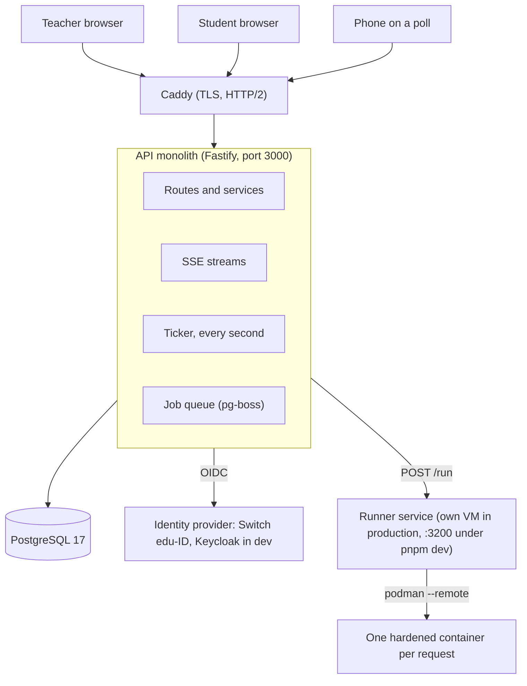
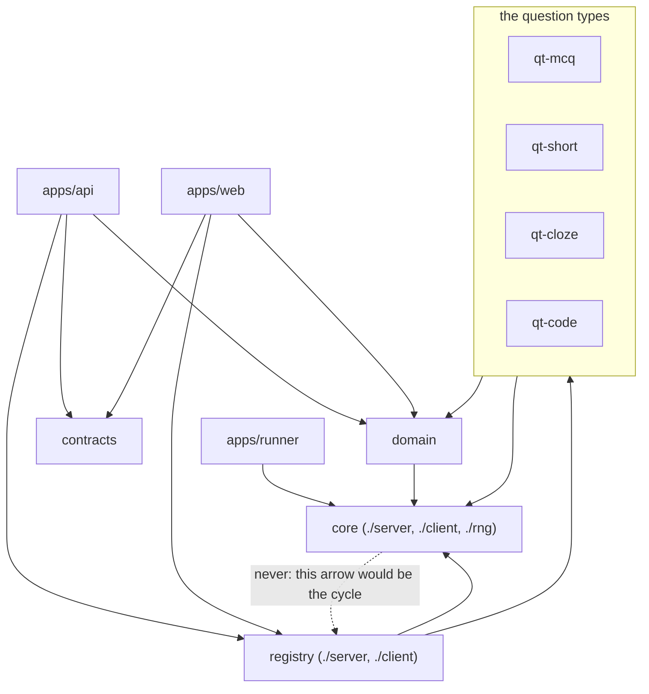
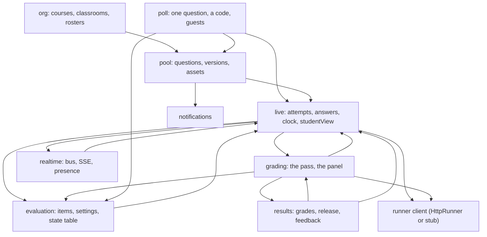
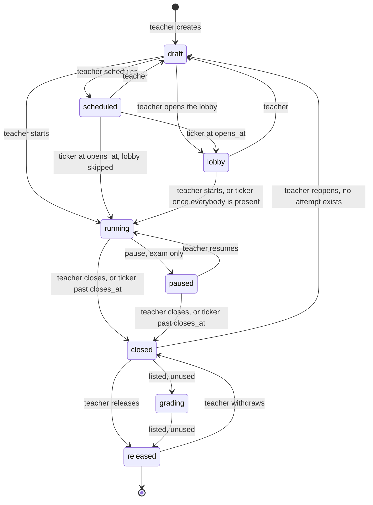
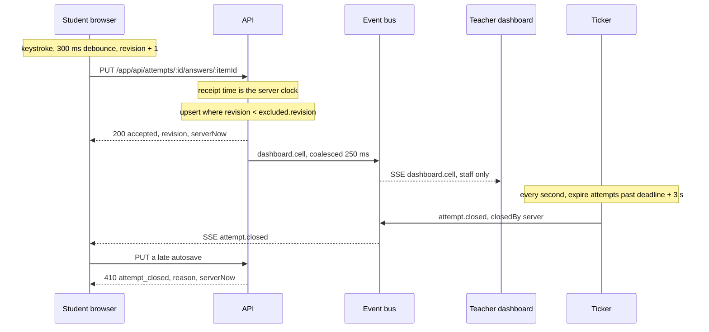
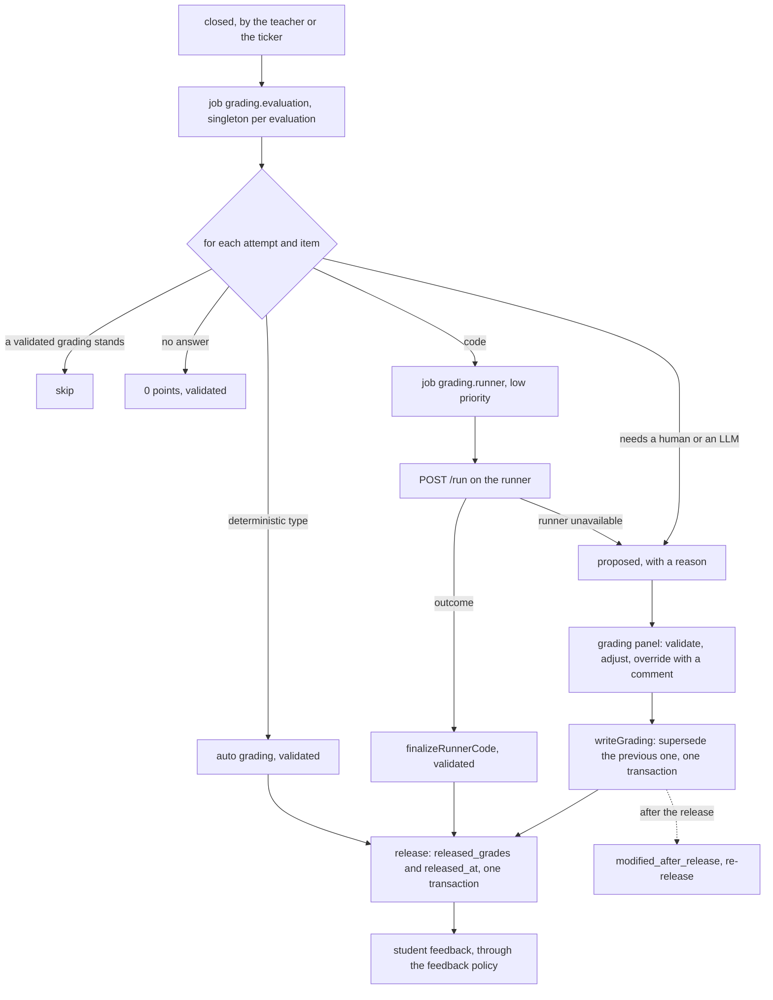
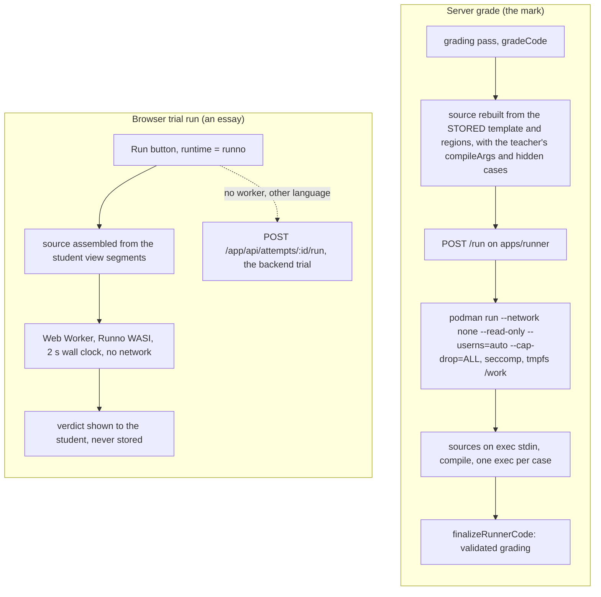
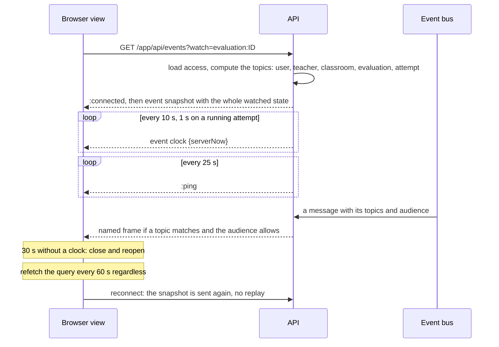

# Architecture

How the system works and how the code is organised, in eight diagrams. Each
one is followed by a short explanation and a link to the text that settles
it: a section of the [architecture chapter](../spec/05-architecture.md) of
the specification, or a decision record. Where to find a file is the job of
the [repository layout](repository.md) page; this one is about the moving
parts.

## System context

One process for the API, one PostgreSQL, one runner service. In production
the runner sits on a second VM; everything else shares one. The browser
talks to Caddy only. The API talks to the database, the runner and the
identity provider. Nothing else talks to anything.

Caddy terminates TLS and speaks HTTP/2 to the browser, which is what lets a
page hold a long-lived SSE stream without eating one of the six HTTP/1.1
connections. The API is a modular monolith: one Fastify process serves the
routes, the built SPA and the event streams, and runs the ticker and the job
queue in the same process. The runner is a separate service reached by the
API alone. In production it runs on a VM of its own, `code.chevallier.io`,
behind that VM's Caddy, over HTTPS with a shared bearer token
([ADR-016](../adr/ADR-016-runner-sur-vm-separee.md)); `pnpm dev` starts it
on the same machine, on port 3200, with no token. Either way it drives
Podman over a socket to create one container per request. In production the identity
provider is Switch edu-ID; in development it is a Keycloak realm from
`infra/keycloak`, or the dev login. Settled by
[5.1 Technical stack](../spec/05-architecture.md#51-technical-stack),
[5.9 Deployment](../spec/05-architecture.md#59-deployment) and
[ADR-001](../adr/ADR-001-monolithe-modulaire.md).

## Repository and package graph

Three applications and eight workspace packages. The arrows below are the
`workspace:*` dependencies read from the `package.json` files, and nothing
else.

`core` sits at the bottom: the `QuestionTypeServer` and `QuestionTypeClient`
contracts, the seeded RNG and the runner interface, with no React at runtime
in either entry point. Every `qt-*` package implements that contract and
depends on `domain` for its pure rules. `registry` is the only package that
imports the `qt-*` packages: it is the static map from a type id to its
implementation, split in `./server` and `./client` so the API never loads a
component. If `core` held the registry, `core` would import `qt-mcq` and
`qt-mcq` would import `core`, which is the cycle decision D1 breaks by moving
the wiring one package up. The apps also depend on every `qt-*` package
directly, which is omitted above because the registry already carries the
edge. Settled by
[5.2 Code modularity](../spec/05-architecture.md#52-code-modularity) and
decision D1 of the [MVP plan](../PLAN-MVP.md).

## API module map

Modules live under `apps/api/src/modules/`. A module never imports another
module's `routes.ts`; it calls its `service.ts`. The arrows below are the
service-level imports that actually exist in the code, kept to the ones
that carry meaning.

Three edges deserve a word. `live` and `evaluation` point at each other on
purpose: the legality of a state change is `evaluation`'s table, and the
side effects on the attempts (starting them, moving their deadlines, expiring
them) are `live`'s, which calls back into `applyState`. `live/studentView.ts`
is the one exit of question content towards a student (invariant 4), which
is why `pool`, `poll`, `grading` and `results` all import it. `pool/config.ts`
is the only file that imports `@quiz/registry/server`; every module that
needs a question type goes through it, and those edges are left out above.
Every live event is built and addressed in `realtime/bus.ts`; `live`,
`grading`, `poll`, `pool`, `results` and `notifications` all call one of its
named functions and never touch the emitter, and only the `live` edge is
drawn. `realtime` calls back into `live` for the snapshot a stream opens
with. `auth`, `guards.ts`
and the single-file modules (`admin`, `courses`, `roster`, `student`,
`avatar`) are omitted. Settled by
[5.2 API modules](../spec/05-architecture.md#52-code-modularity) and
[ADR-001](../adr/ADR-001-monolithe-modulaire.md).

## The lifecycle of an evaluation

The state machine is a table, `TRANSITIONS` in
`apps/api/src/modules/evaluation/service.ts`. A teacher action goes through
one route per transition; the ticker moves an evaluation when a time comes.

A poll takes the short path: `POST /app/api/polls` creates the evaluation
already `running`, with one item and a session code, and
`POST /app/api/evaluations/:id/poll/end` moves it to `closed` without ever
releasing it, because its result is the tally on the beamer. The ticker
handles three times: `opens_at` sends a `scheduled` evaluation to `lobby`
(or straight to `running` when the lobby is skipped), a lobby in `auto`
mode starts when every enrolled student is present, and `closes_at` plus
the last deadline anybody holds, plus the 3 s grace, closes a `running` or
`paused` evaluation. Closing, by a teacher or by the ticker, expires every
open attempt and enqueues the grading pass in the same function. The
`grading` state exists in the enum and in the table for the results module
to tolerate it, but no code path in the repository moves an evaluation into
it. Settled by
[1.4 Lifecycles](../spec/01-glossaire-et-domaine.md#14-lifecycles),
[ADR-006](../adr/ADR-006-deadline-ticker.md) and, for the poll,
[ADR-014](../adr/ADR-014-sondages-en-direct.md).

## One answer, live

What happens between a keystroke and the teacher's grid, and what happens
when the deadline passes.

The client never has more than one request in flight per item; the next one
waits and leaves with the latest payload. The server's `revision` guard makes
the write last-writer-wins: a stale write is answered with the stored
payload, which the client adopts. Every response carries `serverNow`, and the
client keeps the median of the last five offsets, corrected by half the
round trip, to drive the countdown. The receipt time is the server's, the
deadline is closed by the ticker, and a write later than `deadline + 3 s` is
refused with `410 attempt_closed`; the same `GRACE_MS` from `@quiz/domain`
serves both the gate and the ticker. Settled by
[5.4 Real time](../spec/05-architecture.md#54-real-time) (autosave and
clock) and [ADR-006](../adr/ADR-006-deadline-ticker.md).

## Grading and release

Closing an evaluation starts the automatic pass. The teacher then validates
what the machine could only propose, and the release freezes the grades.

A grading is never updated in place: `writeGrading` supersedes the standing
one and links to it, so every cell keeps its history. Every job is
idempotent, because it checks for a validated grading before writing, and a
machine with no container engine still closes, grades and releases; its code
answers simply arrive in the panel as proposals. The grade freeze has two
steps, which is the property `results/service.ts` takes from ADR-012: the
gradings are the live, recomputable truth, and the release writes the frozen
snapshot `released_grades` and `released_at` together in one transaction. A
correction landing after that does not change the snapshot; it flags the
evaluation `modified_after_release`, and the teacher re-releases. Feedback
reaches a student only through `studentFeedback`, which applies the
evaluation's policy (`none`, `on_release`, `immediate`). Settled by
[5.6 Grading](../spec/05-architecture.md#56-grading),
[5.3 Transactions](../spec/05-architecture.md#53-database) and
[ADR-012](../adr/ADR-012-gel-note-deux-temps.md), written for the sibling
project and carried over for its freeze property.

## A code question, two runners

A student's Run button and the grade take two different paths on purpose.
The browser runs a trial; the server computes the mark.

The browser path exists because a `printf` should not need a container, and
thirty students fiddling should not spend the runner's slots. It runs the
program in a Web Worker so that `terminate()` is the stop button, with the
`.wasm` runtimes served from this origin, and it only ever sees what
`toStudent` already publishes: the visible cases, never `compileArgs` or the
hidden ones. Its result is labelled an essay, because WASI is not Linux and
nothing signs the page. The grade always goes through `ctx.runner`: the
source is assembled from the stored template and the student's editable
regions (invariant 14), and one hardened container is created per request
with the flag list `containerArgs` asserts. Nothing from the host is mounted;
the sources travel in on `podman exec`'s stdin, and `/work` is a tmpfs that
dies with the container. Settled by
[ADR-015](../adr/ADR-015-execution-navigateur-correction-serveur.md),
[5.5 Runner](../spec/05-architecture.md#55-runner) and the runner invariants
in `CLAUDE.md`.

## Real time

One SSE stream per page, `GET /app/api/events`, with an optional
`?watch=evaluation:<id>` or `?watch=attempt:<id>`. Writes never travel on it;
they are REST requests.

Authorisation is loaded once, at connection time: the topic set is computed
from the user's seats and enrolments, and a `dashboard.*` frame is dropped
for a student even when they watch the same `evaluation:<id>`. A hint frame
is unnamed and carries no data; the client refetches its queries. A live
event is a named frame with a typed payload from `contracts`, applied
directly to the client state, and the noisy ones (`dashboard.cell`,
`dashboard.presence`, `lobby.count`, `poll.tally`) are coalesced in the bus
over a window per key. There is no `Last-Event-ID` and no replay buffer: a
lost event is repaired by the snapshot on the next connection or by the
safety refetch, and presence lives in memory in the `realtime` module.
Settled by [5.4 Real time](../spec/05-architecture.md#54-real-time) and
[ADR-005](../adr/ADR-005-sse-sans-websocket.md).
