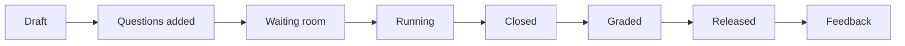

# Overview

HEIG Quiz is a platform for running evaluations in class and grading them. You write questions once, in pools that belong to you; you assemble them into an evaluation for a classroom; you open the evaluation from a dashboard while the students answer from their own browser; the server closes it at the deadline, grades what can be graded automatically, and you validate the rest before releasing the results. Multiple-choice, short-answer, fill-in-the-blanks and code questions are built in, and code is compiled and run in a sandbox on the server.

It is built for one thing: a teacher who wants to run a test, an exercise or a quick poll without leaving the room, with a clock that nobody can argue with. Everything the students see comes from what you published, nothing more.

<figure markdown="span">
  
  
  <figcaption>The teacher's home: one card per course, with its classrooms, its staff and its pools.</figcaption>
</figure>

## Three roles

Everyone signs in with **Sign in with Switch edu-ID**; there is no local password.

Teacher
:   Creates courses, classrooms, pools and evaluations, and grades. You are a teacher when an administrator has granted your e-mail address, when a colleague has added you to the staff of a course, or when edu-ID reports you as staff. See [Administration](admin.md).

Student
:   Sees the classrooms whose roster carries their e-mail address, and the evaluations their teachers open there. A seat is claimed at the first sign-in with a matching address; there is no code to enter. See [For students](students.md).

Administrator
:   One e-mail address named in the server configuration. The administrator grants and revokes the teacher role and reaches every course.

## The vocabulary

| Term | What it means here |
| --- | --- |
| Course | The lasting unit you teach, with a name and a short code, for example "Programmation C" and `PRG1`. It holds the staff, the classrooms and the linked pools. |
| Classroom | One group following a course for one period. Rosters, evaluations and results live in a classroom. |
| Roster and seat | The class list. Each row is a seat with a name, an e-mail address and an extra-time percentage; a seat is **pending** until the student claims it. |
| Pool | A collection of questions, with categories and tags. A pool belongs to you, not to a course; a course draws on the pools linked to it. |
| Question and published version | A question is the stable entry in a pool. Its content lives in numbered versions; only a published version can be used in an evaluation, and a published version never changes. |
| Evaluation | An ordered set of published question versions, run in a classroom with a timing, a feedback policy and a grade scale. |
| Mode | **Exam**: timed per student, opened from a waiting room. **Exercise**: open until a common deadline, no waiting room. **Poll**: one question on the wall, answered by whoever is in the room. |
| Attempt | One student's participation in one evaluation, with its start, its deadline and its state. |
| Grading | The points given to an answer. Automatic gradings arrive already validated for deterministic types; you validate or adjust the rest. |
| Release | The moment the grades, and whatever the feedback policy allows, become visible to the students. |

## The life of an evaluation

1. Write and publish questions in a pool, and link the pool to the course: [Question pools](pools.md) and [Question types](question-types.md).
2. In a classroom, create an evaluation, add questions, choose the timing and the mode: [Evaluations](evaluations.md).
3. Open the waiting room, start, watch the grid, pause or extend if needed, and let the server close it: [Running an evaluation](live.md).
4. Validate the proposed gradings, publish the results, export the CSV: [Grading and results](grading.md).

An exercise skips the waiting room and closes by itself at its deadline. A poll starts running the moment you launch it and ends when you end it: it is never graded or released.

## Where to find things

- **Courses**, the first entry of the sidebar, is the home page: your courses, their classrooms, their staff and their pools. [Courses and classrooms](classrooms.md).
- **Question pools** lists your pools and opens their questions. [Question pools](pools.md).
- **Poll** starts a one-question poll on the projector. [Live polls](polls.md).
- The **Classrooms** section of the sidebar lists your classrooms, one row each. A classroom holds the roster and the evaluations; from an evaluation row you reach its setup, its dashboard, its grading and its results. [Courses and classrooms](classrooms.md), [Evaluations](evaluations.md).
- **Administration** appears only for the administrator. [Administration](admin.md).
- The account row at the bottom of the sidebar opens **Settings** and the theme, and lets a teacher switch to the student view. [Getting started](getting-started.md).
