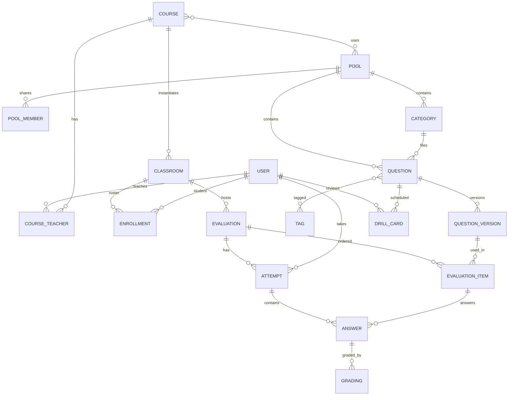

# 1. Glossary and domain model

One concept, one word. The terms below are used as they are in the spec, the code and the interface.

## 1.1 Glossary

| Term | Definition |
|---|---|
| User | A person authenticated by edu-ID. Carries a global role: `student`, `teacher` or `admin`. The role comes from the edu-ID affiliation attribute, the admin is a configured edu-ID. |
| Course | A teacher's teaching unit, persistent from one year to the next. E.g. "Programmation C". References one or more pools. |
| Classroom | An instance of a course for a group and a period. E.g. "Prog C, class A, autumn 2026". Owns a roster. |
| Roster | The list of the students of a classroom, with their accommodations. Fed by CSV import or by self-enrolment with a classroom code. |
| Pool | A collection of questions. Private to a teacher, or shared with roles. A global public pool is readable by every teacher. |
| Category | A hierarchical folder in a pool. Used for filing, not for permissions. |
| Tag | A free keyword attached to a question. Used for search, statistics and quiz generation. |
| Question | A stable entity of the pool, identified by an id. Carries the type, the internal name, the tags, the difficulty. Its content lives in its versions. |
| Question version | The content of a question at a point in time: statement, configuration, answer key, explanation. Numbered 1, 2, 3. Immutable once published. |
| Draft | The version being edited, unnumbered, never usable in an evaluation. Publishing creates the next version. |
| Question type | A plugin that defines the configuration schema, the answer schema, the editor, the player, the review view and the grader. E.g. `mcq`, `short`, `cloze`, `code`. |
| Evaluation | An ordered set of question versions with run settings, created in a classroom. A single term: no quiz, assignment, activity or session. |
| Evaluation mode | `exam` timed and graded, `exercise` open with a deadline, `poll` one live question. |
| Attempt | A student's participation in an evaluation. Only one per student and per evaluation in phase 1. Carries the start time, the effective end, the state. |
| Answer | The current state of a student's answer to a question of an evaluation. One record per attempt and per question, updated on every autosave. |
| Grading | The result of assessing an answer: points, source, state, justification. Several successive gradings are possible, the last one is authoritative. |
| Grader | The function of the question type that produces a grading from the configuration and the answer. Synchronous, asynchronous through the runner, or LLM. |
| Grade | The conversion of an attempt's points into a Swiss grade from 1 to 6 to the tenth, according to the evaluation's grade scale. |
| Grade scale | The rule converting points into a grade for an evaluation: linear, or linear with a threshold for the 6. |
| Explanation | Markdown text attached to a question version, shown to the student according to the feedback policy, and to the teacher during grading. |
| Feedback | The disclosure policy: `none`, `on_release`, `immediate`. |
| Drill | An individual practice session generated for a student from the questions seen in class, scheduled by spaced repetition. |
| Runner | An isolated service that compiles and runs the students' code in a sandbox. |
| Canonical format | The YAML representation of a question or a pool, independent of the database, used for import, export and external versioning. |

## 1.2 Roles and permissions

| Action | Student | Teacher | Admin |
|---|---|---|---|
| See and answer own evaluations, results, drills | Yes | No | No |
| Create a course, a classroom, import a roster | No | Yes | Yes |
| Create a private pool, edit its questions | No | Yes | Yes |
| Read the public pool | No | Yes | Yes |
| Edit a shared pool | No | According to the role on the pool | Yes |
| Create, launch, drive, grade an evaluation | No | On own classrooms | Yes |
| See the grades of a classroom | Own grades | On own classrooms | Yes |
| Configure the LLM providers, the runner languages, the admins | No | Own API key | Yes |
| Delete a classroom or an evaluation and its data | No | On own classrooms | Yes |

Roles on a shared pool, phase 2: `reader` may read and copy into their own pool, `contributor` may create and publish versions, `owner` manages members and deletes.

A course may have several teachers. They all have the same rights on its classrooms.

## 1.3 Domain model

### Key attributes

- **USER**: `id`, `eduid_sub`, `email`, `display_name`, `role`, `locale`, `theme`, `llm_api_key` encrypted.
- **COURSE**: `id`, `name`, `code`.
- **CLASSROOM**: `id`, `course_id`, `name`, `period`, `join_code`, `archived_at`.
- **ENROLLMENT**: `classroom_id`, `user_id`, `time_bonus_percent` integer, 0 by default, `note`.
- **POOL**: `id`, `name`, `visibility` `private` / `shared` / `public`, `owner_id`.
- **QUESTION**: `id`, `pool_id`, `category_id`, `type`, `internal_name`, `difficulty` 1 to 5, `created_by`, `origin_question_id` for a fork.
- **QUESTION_VERSION**: `question_id`, `number` null for the draft, `config` JSONB conforming to the type's schema, `explanation`, `published_at`, `published_by`, `change_note`.
- **EVALUATION**: `id`, `classroom_id`, `title`, `mode`, `state`, `settings` JSONB, see [02-exigences-fonctionnelles.md](02-exigences-fonctionnelles.md) F-EVAL, `grading_scale`, `feedback_policy`, `opens_at`, `closes_at`, `duration_s`.
- **EVALUATION_ITEM**: `evaluation_id`, `position`, `question_version_id`, `points`, `milestone` boolean.
- **ATTEMPT**: `evaluation_id`, `user_id`, `state`, `started_at`, `deadline_at` computed with the bonus, `submitted_at`, `seed`, `client_events` JSONB for light cheating events.
- **ANSWER**: `attempt_id`, `item_id`, `payload` JSONB conforming to the type's answer schema, `revision` integer incremented on every autosave, `marked_done`, `updated_at`.
- **GRADING**: `answer_id`, `points`, `max_points`, `source` `auto` / `llm` / `manual`, `state` `proposed` / `validated` / `superseded`, `details` JSONB, `graded_by`, `graded_at`, `note` for the annotation of a re-grading.
- **DRILL_CARD**: `user_id`, `question_id`, FSRS parameters `stability`, `difficulty`, `due_at`, `last_review_at`.

### Invariants

1. An evaluation references only published versions. The draft is never referenced.
2. A published version never changes. Fixing an answer key creates a version.
3. An attempt has at most one answer per item. The autosave updates the answer in place and increments `revision`. The server rejects a revision lower than the current revision.
4. An answer has at most one grading in state `validated`. A new grading moves the previous one to `superseded`.
5. The grade of an attempt is computed from the validated gradings, never stored as the source of truth. It is cached when the results are released.
6. The content sent to a student never contains the answer key nor the explanation before the feedback policy allows it.

## 1.4 Lifecycles

**Question version**: `draft` → publish → `published` number N. A published version may be marked `deprecated` to signal that a more recent version fixes an error.

**Evaluation**: `draft` → `scheduled` → `lobby` waiting room → `running` → `paused` ↔ `running` → `closed` → `grading` → `released`. The `exercise` mode skips `lobby` and `paused`. The `poll` mode goes from `running` to `released` directly.

**Attempt**: `not_started` → `in_progress` → `submitted` by the student or `expired` by the server at the deadline. Both terminal states can be graded.

**Grading**: `proposed` → `validated`. An `auto` grading on a fully deterministic type is born `validated`. An `llm` grading is born `proposed`. A manual grading is born `validated`.
