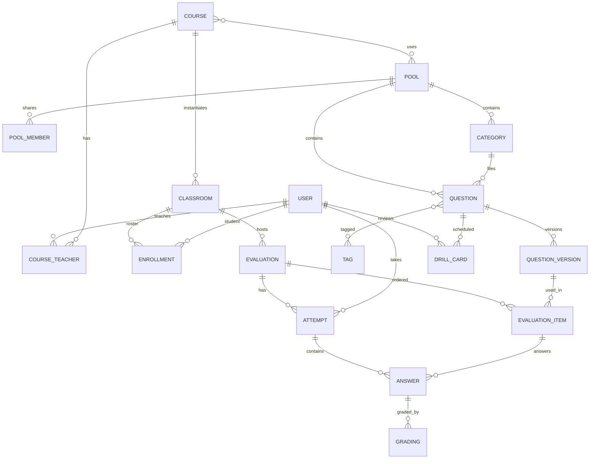

# 1. Glossaire et modèle de domaine

Un concept, un mot. Les termes ci-dessous sont utilisés tels quels dans la spec, le code et l'interface.

## 1.1 Glossaire

| Terme | Définition |
|---|---|
| Utilisateur | Personne authentifiée par edu-ID. Porte un rôle global : `student`, `teacher` ou `admin`. Le rôle vient de l'attribut d'affiliation edu-ID, l'admin est un edu-ID configuré. |
| Cours | Unité d'enseignement d'un prof, pérenne d'une année à l'autre. Ex. "Programmation C". Référence un ou plusieurs pools. |
| Classroom | Instance d'un cours pour un groupe et une période. Ex. "Prog C, classe A, automne 2026". Possède un roster. |
| Roster | Liste des étudiants d'une classroom, avec leurs aménagements. Alimenté par import CSV ou par auto-inscription avec un code de classroom. |
| Pool | Collection de questions. Privé à un prof, ou partagé avec des rôles. Un pool public global est lisible par tous les profs. |
| Catégorie | Dossier hiérarchique dans un pool. Sert au rangement, pas aux droits. |
| Tag | Mot-clé libre attaché à une question. Sert à la recherche, aux statistiques et à la génération de quiz. |
| Question | Entité stable du pool, identifiée par un id. Porte le type, le nom interne, les tags, la difficulté. Son contenu vit dans ses versions. |
| Version de question | Contenu d'une question à un instant : énoncé, configuration, clé de réponse, explication. Numérotée 1, 2, 3. Immuable une fois publiée. |
| Brouillon | Version en cours d'édition, non numérotée, jamais utilisable dans une évaluation. Publier crée la version suivante. |
| Type de question | Plugin qui définit le schéma de configuration, le schéma de réponse, l'éditeur, le player, la vue de review et le grader. Ex. `mcq`, `short`, `cloze`, `code`. |
| Évaluation | Ensemble ordonné de versions de questions avec des paramètres de déroulement, créé dans une classroom. Terme unique : pas de quiz, travail, activité ou session. |
| Mode d'évaluation | `exam` chronométré et noté, `exercise` ouvert avec délai, `poll` une question en direct. |
| Tentative | Participation d'un étudiant à une évaluation. Une seule par étudiant et par évaluation en phase 1. Porte l'heure de début, la fin effective, l'état. |
| Réponse | État courant de la réponse d'un étudiant à une question d'une évaluation. Un enregistrement par tentative et par question, mis à jour à chaque autosave. |
| Correction | Résultat de l'évaluation d'une réponse : points, source, état, justification. Plusieurs corrections successives possibles, la dernière fait foi. |
| Grader | Fonction du type de question qui produit une correction à partir de la configuration et de la réponse. Synchrone, asynchrone via le runner, ou LLM. |
| Note | Conversion des points d'une tentative en note suisse de 1 à 6 au dixième, selon le barème de l'évaluation. |
| Barème | Règle de conversion points vers note pour une évaluation : linéaire, ou linéaire avec seuil pour le 6. |
| Explication | Texte markdown attaché à une version de question, montré à l'étudiant selon la politique de feedback, et au prof pendant la correction. |
| Feedback | Politique de restitution : `none`, `on_release`, `immediate`. |
| Drill | Séance d'entraînement individuelle générée pour un étudiant à partir des questions vues en cours, planifiée par répétition espacée. |
| Runner | Service isolé qui compile et exécute le code des étudiants dans une sandbox. |
| Format canonique | Représentation YAML d'une question ou d'un pool, indépendante de la base, utilisée pour l'import, l'export et le versionnage externe. |

## 1.2 Rôles et permissions

| Action | Étudiant | Prof | Admin |
|---|---|---|---|
| Voir et répondre à ses évaluations, ses résultats, ses drills | Oui | Non | Non |
| Créer un cours, une classroom, importer un roster | Non | Oui | Oui |
| Créer un pool privé, y éditer des questions | Non | Oui | Oui |
| Lire le pool public | Non | Oui | Oui |
| Éditer un pool partagé | Non | Selon rôle sur le pool | Oui |
| Créer, lancer, piloter, corriger une évaluation | Non | Sur ses classrooms | Oui |
| Voir les notes d'une classroom | Les siennes | Sur ses classrooms | Oui |
| Configurer les fournisseurs LLM, les langages du runner, les admins | Non | Sa propre clé API | Oui |
| Supprimer une classroom ou une évaluation et ses données | Non | Sur ses classrooms | Oui |

Rôles sur un pool partagé, phase 2 : `reader` peut lire et copier dans son pool, `contributor` peut créer et publier des versions, `owner` gère les membres et supprime.

Un cours peut avoir plusieurs profs. Tous ont les mêmes droits sur ses classrooms.

## 1.3 Modèle de domaine

### Attributs clés

- **USER** : `id`, `eduid_sub`, `email`, `display_name`, `role`, `locale`, `theme`, `llm_api_key` chiffrée.
- **COURSE** : `id`, `name`, `code`.
- **CLASSROOM** : `id`, `course_id`, `name`, `period`, `join_code`, `archived_at`.
- **ENROLLMENT** : `classroom_id`, `user_id`, `time_bonus_percent` entier, 0 par défaut, `note`.
- **POOL** : `id`, `name`, `visibility` `private` / `shared` / `public`, `owner_id`.
- **QUESTION** : `id`, `pool_id`, `category_id`, `type`, `internal_name`, `difficulty` 1 à 5, `created_by`, `origin_question_id` pour un fork.
- **QUESTION_VERSION** : `question_id`, `number` null pour le brouillon, `config` JSONB conforme au schéma du type, `explanation`, `published_at`, `published_by`, `change_note`.
- **EVALUATION** : `id`, `classroom_id`, `title`, `mode`, `state`, `settings` JSONB, voir [02-exigences-fonctionnelles.md](02-exigences-fonctionnelles.md) F-EVAL, `grading_scale`, `feedback_policy`, `opens_at`, `closes_at`, `duration_s`.
- **EVALUATION_ITEM** : `evaluation_id`, `position`, `question_version_id`, `points`, `milestone` booléen.
- **ATTEMPT** : `evaluation_id`, `user_id`, `state`, `started_at`, `deadline_at` calculée avec le bonus, `submitted_at`, `seed`, `client_events` JSONB pour les événements de tricherie légère.
- **ANSWER** : `attempt_id`, `item_id`, `payload` JSONB conforme au schéma de réponse du type, `revision` entier incrémenté à chaque autosave, `marked_done`, `updated_at`.
- **GRADING** : `answer_id`, `points`, `max_points`, `source` `auto` / `llm` / `manual`, `state` `proposed` / `validated` / `superseded`, `details` JSONB, `graded_by`, `graded_at`, `note` pour l'annotation d'une re-correction.
- **DRILL_CARD** : `user_id`, `question_id`, paramètres FSRS `stability`, `difficulty`, `due_at`, `last_review_at`.

### Invariants

1. Une évaluation ne référence que des versions publiées. Le brouillon n'est jamais référencé.
2. Une version publiée ne change jamais. Corriger une clé de réponse crée une version.
3. Une tentative a au plus une réponse par item. L'autosave met à jour la réponse en place et incrémente `revision`. Le serveur rejette une révision inférieure à la révision courante.
4. Une réponse a au plus une correction en état `validated`. Une nouvelle correction passe la précédente en `superseded`.
5. La note d'une tentative est calculée à partir des corrections validées, jamais stockée comme source de vérité. Elle est mise en cache au moment de la publication des résultats.
6. Le contenu envoyé à un étudiant ne contient jamais la clé de réponse ni l'explication avant que la politique de feedback l'autorise.

## 1.4 Cycles de vie

**Version de question** : `draft` → publier → `published` numéro N. Une version publiée peut être marquée `deprecated` pour signaler qu'une version plus récente corrige une erreur.

**Évaluation** : `draft` → `scheduled` → `lobby` salle d'attente → `running` → `paused` ↔ `running` → `closed` → `grading` → `released`. Le mode `exercise` saute `lobby` et `paused`. Le mode `poll` passe de `running` à `released` directement.

**Tentative** : `not_started` → `in_progress` → `submitted` par l'étudiant ou `expired` par le serveur à la deadline. Les deux états terminaux sont corrigeables.

**Correction** : `proposed` → `validated`. Une correction `auto` sur un type entièrement déterministe naît `validated`. Une correction `llm` naît `proposed`. Une correction manuelle naît `validated`.
