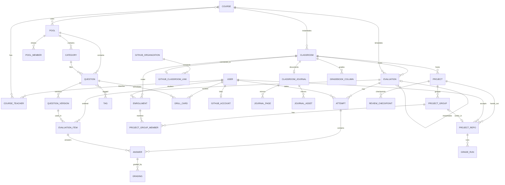

# 1. Glossary and domain model

One concept, one word. The terms below are used as they are in the spec, the code and the interface.

## 1.1 Glossary

| Term | Definition |
|---|---|
| User | A person authenticated by edu-ID. Carries a global role: `student`, `teacher` or `admin`. The role comes from the edu-ID affiliation attribute, the admin is a configured edu-ID. |
| Course | A teacher's teaching unit, persistent from one year to the next. E.g. "Programmation C". References one or more pools. |
| Hidden course | A course a user took out of their own navigation (F-ORG-11). A per-user display state, not a state of the course: the word is "hidden", never "archived", which is a state of a classroom seen by the whole staff. |
| Classroom | An instance of a course for a group and a period. E.g. "Prog C, class A, autumn 2026". Owns a roster. May be connected to one GitHub organization and carry one journal (ADR-035). heig-classroom's "classroom" (top-level, bound to an organization) maps to a course plus a classroom here. |
| Period | When a classroom runs: a free label (`2026-A`, "Autumn 2026") and, optionally, a first and a last month (`YYYY-MM`, both or neither). The HEIG-VD semesters are the presets: autumn N = September N – January N+1, spring N = February – July. A dated classroom is *current* while its months, give or take one month on each side, cover today; an undated one is always current. "Ended" is computed, never written: nothing is archived automatically. |
| Roster | The list of the students of a classroom, with their accommodations. Fed by the teacher only, by CSV import or by hand; a student's line is claimed at sign-in on a matching address (ADR-053). |
| Pool | A collection of questions. Private to a teacher, or shared with roles. A global public pool is readable by every teacher. |
| Category | A hierarchical folder in a pool. Used for filing, not for permissions. |
| Tag | A free keyword attached to a question. Used for search, statistics and quiz generation. |
| Question | A stable entity of the pool, identified by an id. Carries the type, the internal name, the tags, the difficulty. Its content lives in its versions. |
| Question version | The content of a question at a point in time: statement, configuration, answer key, explanation. Numbered 1, 2, 3. Immutable once published. |
| Draft | The version being edited, unnumbered, never usable in an evaluation. Publishing creates the next version. |
| Question type | A plugin that defines the configuration schema, the answer schema, the editor, the player, the review view and the grader. E.g. `mcq`, `short`, `cloze`, `code`. |
| Evaluation | An ordered set of question versions with run settings, created in a classroom. A single term: no quiz, assignment or session. |
| Activity | What a classroom gives its students to do: an evaluation (exam, exercise, poll) or a project. The student's **Activities** is the summary of the active activities of all their classrooms. The journal is not an activity. heig-classroom's commit-graph panel is called "repository history", never "activity". |
| Project | The activity kind of the merge (D01): graded work in a GitHub repository of the classroom's organization, one per student or per group, a lab as well as a semester project (F-PROJ). heig-classroom's "assignment"; the word "assignment" stays forbidden outside migration code and the wire names GitHub already carries (I16). |
| Source repository | The teacher's repository a project is made from, in the classroom's organization. Never shown to a student, nor its existence. Never called a "template", which is an evaluation template's word. |
| Distribution repository | The private repository the platform builds from the source and hands out from (`<slug>-squashed`): the source's tree in one commit per branch (`squash`), or its history (`whole`). Written by the App only. |
| Student repository | The repository of one student, or of one group (*group repository*), made at Accept from the distribution repository, with which it shares an ancestor. The student holds the `push` permission, never more. |
| Project group | A team of students for one project, formed by the staff; one repository per group (ADR-048). A student is in at most one group of a project. |
| Push receipt | The server's own record of a push to a tracked repository — head commit and the time the platform received the webhook — written as the webhook arrives. The legal reference of a deadline: the commit's date is never trusted (ADR-012). |
| Grade run | One CI run of `grading.yml` on a student repository, with the score it reported (`points / max`) or why it has none. Immutable. heig-classroom's name, kept for the table (`project_grade_runs`), though it holds a score. |
| Score | Points out of a maximum, as a project's CI reports them (`4.5/6`). Never a grade: a score becomes a grade through the project's grading scale, at the release. |
| Repository deadline | A student repository's own deadline, an individual extension its staff set (D13 as amended 2026-10-02). Its **effective deadline** is that one when set, else the project's: every deadline rule of a repository — its lock or commit, a late receipt, its freeze — reads the effective one. Never the roster's extra time (F-ORG-07). |
| Frozen score | The score of a repository at its (effective) deadline: provisional at the deadline, definitive at the deadline plus the grace. Later runs never change it. |
| Final score | The score a project's release gives a student: the teacher's, else the final review's, else the frozen score. |
| Review checkpoint | A dated step of a project at which the repository's CI is asked for a review of the work so far (`grade-milestone` on the wire). Never counts for the score. heig-classroom's "milestone", a word Quiz keeps for an evaluation's navigation checkpoint. |
| CI runner | The self-hosted GitHub Actions runners that run a project's CI (ADR-007). Never "runner" alone, which is `apps/runner`. |
| Release | The one verb for making results the students': an evaluation's results (F-GRADE-09), a project's final scores (F-PROJ-14). heig-classroom's "validate the grades" is a release. |
| Gradebook | A classroom's grades in one table: a column per released activity that counts, a row per student, a weighted mean (F-GBOOK). |
| Gradebook column | One activity of a classroom in its gradebook, with whether it counts and its weight; its cells are read from the activity's released results, never stored. |
| Online workspace | The browser-based workspace a project may be worked in (heig-classroom's codespace, ADR-047); phase M6 of the merge. Never a "session", which an evaluation never has either. |
| Evaluation template | An evaluation kept at the course level rather than in a classroom: its questions, points, order, milestones and settings, without dates nor IP list. Never opened, never answered; each classroom's evaluation is made from it by *Instantiate* and records the template and its revision. `exam` and `exercise` only, never `poll` (ADR-031). |
| Instance | An evaluation linked to a template: instantiated from it into a classroom, or saved as it (*Save as template*, at revision 1). It records the template and the revision it came from, and editing the template never changes it: a newer revision reaches it only when the teacher pulls it (ADR-031). |
| Evaluation mode | `exam` timed and graded, `exercise` open with a deadline, `poll` one live question. |
| Attempt log | The server's record of an attempt's events (`attempt_events`): focus and visibility changes, reconnections, IP changes, time added, pauses, runs. Formerly called the attempt's "journal" (D16); "journal" now means the course journal only. |
| Attempt | A student's participation in an evaluation. An exam has one attempt per student; an exercise may allow retakes, each a new attempt with a new seed (ADR-025). Carries the start time, the effective end, the state. |
| Answer | The current state of a student's answer to a question of an evaluation. One record per attempt and per question, updated on every autosave. |
| Grading | The result of assessing an answer: points, source, state, justification. Several successive gradings are possible, the last one is authoritative. |
| Grader | The function of the question type that produces a grading from the configuration and the answer. Synchronous, asynchronous through the runner, or LLM. |
| Grade | The conversion of an attempt's points into a Swiss grade from 1 to 6 to the tenth, according to the evaluation's grade scale; for a project, of its final score, by the project's grading scale (F-PROJ-14). |
| Grade scale | The rule converting points into a grade for an evaluation: linear, 1 + 5 × points / total, capped at 6, with its rounding. The total leaves the bonus items out (ADR-052). |
| Bonus item | An item of an evaluation whose points are left out of the total: they can only lift a student: under negative marking its score is floored at 0, and the grade stays capped at 6. Set in the builder, locked like the points, labelled "Bonus question" for the student (ADR-052). |
| Explanation | Markdown text attached to a question version, shown to the student according to the feedback policy, and to the teacher during grading. |
| Feedback | The disclosure policy: `none`, `on_release`, `immediate`. |
| Published correction | The correction of an `exercise` published by its teacher while it is still running (F-EVAL-27, ADR-050): the class debrief opens over the papers handed in, and each student's feedback follows the policy as if the results were released. Irreversible; retakes go on. |
| Drill | An individual practice session generated for a student from the questions seen in class, scheduled by spaced repetition. |
| Runner | An isolated service that compiles and runs the students' code in a sandbox. |
| Canonical format | The YAML representation of a question or a pool, independent of the database, used for import, export and external versioning. |
| Quiz's GitHub App | The GitHub App through which the platform acts on GitHub (D23): it reads and writes the repositories of the organizations that installed it, receives their webhooks, and links GitHub accounts. One App per environment: production, and staging on a test organization. heig-classroom's App is a different one; an organization may install both. |
| GitHub organization link | The connection of a classroom to one GitHub organization where Quiz's App is installed (D02, `github_classroom_links`). Made from the classroom's Settings by a member of the course's staff; optional; at most one per classroom. A classroom without it is a plain Quiz classroom. |
| GitHub account link | The attachment of a user's GitHub account (its immutable id and its current login) to their edu-ID account (`github_accounts`). Never a way to sign in. One GitHub account for one user. Needed to be invited as a collaborator to a repository, never to edit a journal in the browser. |
| Journal | A classroom's course documentation, one markdown page per file, written by the staff and read by the students of the classroom. Not an activity: no grade, no deadline, no tracking. At most one per classroom (D03). It has a **mode** (ADR-057): **in Quiz** (the default), where the platform holds the pages and their revisions; or **in a GitHub repository** of the classroom's organization (a branch and an optional root folder), the source of truth, of which the platform keeps a rendered, read-only copy; two classrooms may use the same repository, each with its own copy. |
| Journal page | One markdown file of the journal, rendered on the server. Its place in the navigation comes from its path; its front matter may carry `title`, `date`, `draft: true` (read by the staff only) and `visible_from` (hidden from the students until then). |
| Journal asset | A file of the journal's repository (an image, a PDF) referenced by one of its pages, copied into the read model (≤ 5 MB, D14). |

## 1.2 Roles and permissions

| Action | Student | Teacher | Admin |
|---|---|---|---|
| See and answer own evaluations, results, drills | Yes | No | No |
| Create a course, a classroom, import a roster | No | Yes | Yes |
| Create a private pool, edit its questions | No | Yes | Yes |
| Read the public pool | No | Yes | Yes |
| Edit a shared pool | No | According to the role on the pool | With Super Powers, else as a teacher |
| Create, launch, drive, grade an evaluation | No | On own classrooms | With Super Powers, else as a teacher |
| Create, instantiate, delete an evaluation template | No | On own courses | With Super Powers, else as a teacher |
| See the grades of a classroom | Own grades | On own classrooms | With Super Powers, else as a teacher |
| Configure the institutional LLM gateway | No | No | Yes |
| Configure runner languages and admins | No | No | Yes |
| Connect a classroom to a GitHub organization, create, choose or remove its journal, edit its pages | No | On own classrooms | With Super Powers, else as a teacher |
| Read a classroom's journal | Own classrooms, pages neither draft nor before their `visible_from` | On own classrooms, drafts included | With Super Powers, else as a teacher |
| Link or unlink own GitHub account | Yes | Yes | Yes |
| Create, publish, sync, lock, grade and release a project; form its groups | No | On own classrooms | With Super Powers, else as a teacher |
| Accept a project, see own repository and score | Own classrooms, own repository or own group's | No | No |
| See and export a classroom's gradebook, choose its columns and weights | Own cells, the mean once published | On own classrooms | With Super Powers, else as a teacher |
| Delete a classroom or an evaluation and its data | No | On own classrooms | With Super Powers, else as a teacher |
| Act as a student (a one-time link, ADR-034) | No | No | With Super Powers |

Roles on a shared pool: `reader` may read and copy into their own pool, `contributor` may create and publish versions, `owner` manages members and deletes.

A course may have several teachers. They all reach its classrooms; each seat is `owner` or `assistant` (ADR-068): an owner also manages the staff, the course, its linked pools, its classrooms' creation and deletion, and the release of results.

**Super Powers** (ADR-054): an admin reaches everyone's content only after switching them on
from the settings, for one fixed hour of the server's clock, in that browser session only
(never through an API token or an assistant), each switch audited. Otherwise the admin is a
teacher: their own seats, their pools by their pool role. The admin's own functions — the
teacher grants, the user list, the metrics — never need them.

## 1.3 Domain model

```mermaid
erDiagram
    USER ||--o{ COURSE_TEACHER : teaches
    COURSE ||--o{ COURSE_TEACHER : has
    COURSE ||--o{ CLASSROOM : instantiates
    COURSE }o--o{ POOL : uses
    CLASSROOM ||--o{ ENROLLMENT : roster
    USER ||--o{ ENROLLMENT : student
    POOL ||--o{ POOL_MEMBER : shares
    POOL ||--o{ CATEGORY : contains
    POOL ||--o{ QUESTION : contains
    CATEGORY ||--o{ QUESTION : files
    QUESTION ||--o{ QUESTION_VERSION : versions
    QUESTION }o--o{ TAG : tagged
    CLASSROOM ||--o{ EVALUATION : hosts
    COURSE ||--o{ EVALUATION : templates
    EVALUATION |o--o{ EVALUATION : instantiates
    EVALUATION ||--o{ EVALUATION_ITEM : ordered
    QUESTION_VERSION ||--o{ EVALUATION_ITEM : used_in
    EVALUATION ||--o{ ATTEMPT : has
    USER ||--o{ ATTEMPT : takes
    ATTEMPT ||--o{ ANSWER : contains
    EVALUATION_ITEM ||--o{ ANSWER : answers
    ANSWER ||--o{ GRADING : graded_by
    USER ||--o{ DRILL_CARD : reviews
    QUESTION ||--o{ DRILL_CARD : scheduled
    USER ||--o| GITHUB_ACCOUNT : links
    GITHUB_ORGANIZATION ||--o{ GITHUB_CLASSROOM_LINK : connects
    CLASSROOM ||--o| GITHUB_CLASSROOM_LINK : connected_to
    CLASSROOM ||--o| CLASSROOM_JOURNAL : documents
    CLASSROOM_JOURNAL ||--o{ JOURNAL_PAGE : mirrors
    CLASSROOM_JOURNAL ||--o{ JOURNAL_ASSET : mirrors
    CLASSROOM ||--o{ PROJECT : hosts
    PROJECT ||--o{ PROJECT_GROUP : groups
    PROJECT_GROUP ||--o{ PROJECT_GROUP_MEMBER : has
    ENROLLMENT ||--o{ PROJECT_GROUP_MEMBER : member
    PROJECT ||--o{ REVIEW_CHECKPOINT : checkpoints
    PROJECT ||--o{ PROJECT_REPO : hands_out
    USER ||--o{ PROJECT_REPO : accepts
    PROJECT_GROUP |o--o| PROJECT_REPO : works_in
    PROJECT_REPO ||--o{ GRADE_RUN : runs
    CLASSROOM ||--o{ GRADEBOOK_COLUMN : grades
```

### Key attributes

- **USER**: `id`, `oidc_sub`, `email`, `given_name`, `family_name`, `role`, `locale`. The display name is derived. The institutional LLM key belongs to `llm_settings`, never a user (ADR-058).
- **COURSE**: `id`, `name`, `code`.
- **CLASSROOM**: `id`, `course_id`, `name`, `period`, `period_start`, `period_end`, `archived_at`.
- **ENROLLMENT**: `classroom_id`, `user_id`, `time_bonus_percent` integer, 0 by default, `note`.
- **POOL**: `id`, `name`, `visibility` `private` / `shared` / `public`, `owner_id`.
- **QUESTION**: `id`, `pool_id`, `category_id`, `type`, `internal_name`, `difficulty` 1 to 5, `created_by`, `origin_question_id` for a fork.
- **QUESTION_VERSION**: `question_id`, `number` null for the draft, `config` JSONB conforming to the type's schema, `explanation`, `published_at`, `published_by`, `change_note`.
- **EVALUATION**: `id`, `classroom_id`, `course_id` set on a template only (exactly one home: a classroom, a course, or — an anonymous poll — its owner), `revision` on a template, `origin_template_id` and `origin_revision` on an instance, `title`, `mode`, `state`, `settings` JSONB, see [02-exigences-fonctionnelles.md](02-exigences-fonctionnelles.md) F-EVAL, `grading_scale`, `feedback_policy`, `opens_at`, `closes_at`, `duration_s`, `correction_published_at` (an exercise's published correction, ADR-050), `access_code` (a poll's session code only, ADR-014; an exam or an exercise has none, [ADR-053](../adr/ADR-053-retrait-des-codes-d-entree.md)).
- **EVALUATION_ITEM**: `evaluation_id`, `position`, `question_version_id`, `points`, `milestone` boolean, `bonus` boolean (ADR-052).
- **ATTEMPT**: `evaluation_id`, `user_id`, `state`, `started_at`, `deadline_at` computed with the bonus, `submitted_at`, `seed`, `instances` for stored parameter draws (ADR-056), `attempt_number` for retakes. Attempt events are separate rows in `attempt_events`.
- **ANSWER**: `attempt_id`, `item_id`, `payload` JSONB conforming to the type's answer schema, `revision` integer incremented on every autosave, `marked_done` (the question was validated in a locking navigation), `skipped` ("Leave unanswered": left blank on purpose), `flagged` (the student's review flag), `updated_at`.
- **GRADING**: `answer_id`, `points`, `max_points`, `source` `auto` / `llm` / `manual`, `state` `proposed` / `validated` / `superseded`, `details` JSONB, `graded_by`, `graded_at`, `note` for the annotation of a re-grading.
- **GITHUB_ORGANIZATION**: `github_org_id`, `login`, `installation_id` of Quiz's App (null until installed), `status`, `plan`.
- **GITHUB_CLASSROOM_LINK**: `classroom_id`, `org_id`, `linked_by`, `linked_at`.
- **GITHUB_ACCOUNT**: `user_id`, `github_user_id` unique, `login`, `linked_at`.
- **CLASSROOM_JOURNAL**: `classroom_id`, `mode` `quiz` / `github`, and in GitHub mode `github_repo_id`, `full_name`, `ref`, `root_path`, `last_commit_sha`, `sync_status`, `sync_error`.
- **JOURNAL_PAGE**: `path`, `title`, `front_matter`, `draft`, `visible_from`, the rendered `html` and `toc`, `warnings`.
- **PROJECT**: `id`, `classroom_id`, `name`, `slug`, `state` `draft` / `published` / `locked`, `start_at`, `deadline_at`, `grace_minutes`, the source and distribution repositories, `source_strategy` `whole` / `squash`, `deadline_strategy` `lock` / `commit`, `grading_mode` `auto` / `none`, `publish_mode`, `branches`, `protected_files`, `group_mode`, `grading_scale`, `deadline_applied_at`, `released_at`, `archived_at`.
- **PROJECT_REPO**: `project_id`, `user_id` (who accepted), `group_id` for a group repository, `github_repo_id`, `full_name`, `provision_status`, `invitation_status`, its own `deadline_at` (null: the project's), `deadline_applied_at`, `frozen_at`, `locked_at` (and `archived_at` when the lock fell back to archiving), the staff's hand on the lock (`staff_lock`), `ci_status`, the current, frozen and review grade runs, the teacher's points and comment, `deleted_at`.
- **GRADE_RUN**: `repo_id`, `workflow_run_id`, `run_attempt`, `head_sha`, `conclusion`, `points`, `max`, `parse_status`, `after_deadline`, `completed_at`.
- **GRADEBOOK_COLUMN**: `classroom_id`, the activity, `counts`, `weight`; the classroom's `mean_published`.
- **DRILL_CARD**: `user_id`, `question_id`, FSRS parameters `stability`, `difficulty`, `due_at`, `reps`, `lapses`, `last_review_at`; one per student and question, created at the release of an exam or the hand-in of an exercise (ADR-041). Its reviews record the rating, the active time and the device class.

### Invariants

1. An evaluation references only published versions. The draft is never referenced.
2. A published version never changes. Fixing an answer key creates a version.
3. An attempt has at most one answer per item. The autosave updates the answer in place and increments `revision`. The server rejects a revision lower than the current revision.
4. An answer has at most one grading in state `validated`. A new grading moves the previous one to `superseded`.
5. The grade of an attempt is computed from the validated gradings, never stored as the source of truth. It is cached when the results are released.
6. The content sent to a student never contains the answer key nor the explanation before the feedback policy allows it.
7. A journal page reaches a student only rendered, and only when it is not a draft and its `visible_from` has passed; an asset only when such a page references it (N-SEC-12, N-SEC-13).
8. Removing a journal, or disconnecting a classroom from GitHub, never deletes anything on GitHub.
9. Deleting a project or its classroom never deletes a repository on GitHub (D19).
10. A project's score counts from the platform's receipt time of the commit, never the commit's own date; a run on a commit the App pushed never counts.
11. A project's score reaches a student only through the project's student view, and is indicative until the release (N-SEC-20, N-SEC-21).

## 1.4 Lifecycles

**Question version**: `draft` → publish → `published` number N. A published version may be marked `deprecated` to signal that a more recent version fixes an error.

**Evaluation template**: always `draft`; its `revision` starts at 1 and moves with every committed change to its items or template-level settings, never with its title (ADR-031).

**Evaluation**: `draft` → `scheduled` → `lobby` waiting room → `running` → `paused` ↔ `running` → `closed` → `grading` → `released`. An exercise may use a waiting room (`lobby`) but cannot be paused; only an exam can be paused. A poll ends at `closed`, with deterministic grading and no results release (ADR-014).

**Attempt**: `not_started` → `in_progress` → `submitted` by the student or `expired` by the server at the deadline. Both terminal states can be graded.

**Journal**: in Quiz, created with an editable home page and versioned in the database; in GitHub mode, created or chosen → `sync_status` `pending` → `ok` after ingestion, or `error` when GitHub refuses access (the mirrored pages stay readable). Removal drops the platform's copy, never a GitHub repository (ADR-057).

**Project**: `draft` → publish (now, or by the ticker at its start) → `published` → deadline → `locked`; frozen definitively at the deadline plus the grace, then the final review dispatched, then released by the staff. A deadline moved later reopens it. Archived and unarchived at any time.

**Project repository**: accepted → `provision_status` `pending` → `ok` (or `error`, retried by the student) → invitation `pending` → `accepted`; at its effective deadline applied (provisional freeze) and locked, frozen definitively at the effective deadline plus the grace; its own deadline moved later reopens it alone; `deleted` for good when the repository is gone from GitHub.

**Grading**: `proposed` → `validated`. An `auto` grading on a fully deterministic type is born `validated`. An `llm` grading is born `proposed`. A manual grading is born `validated`.
